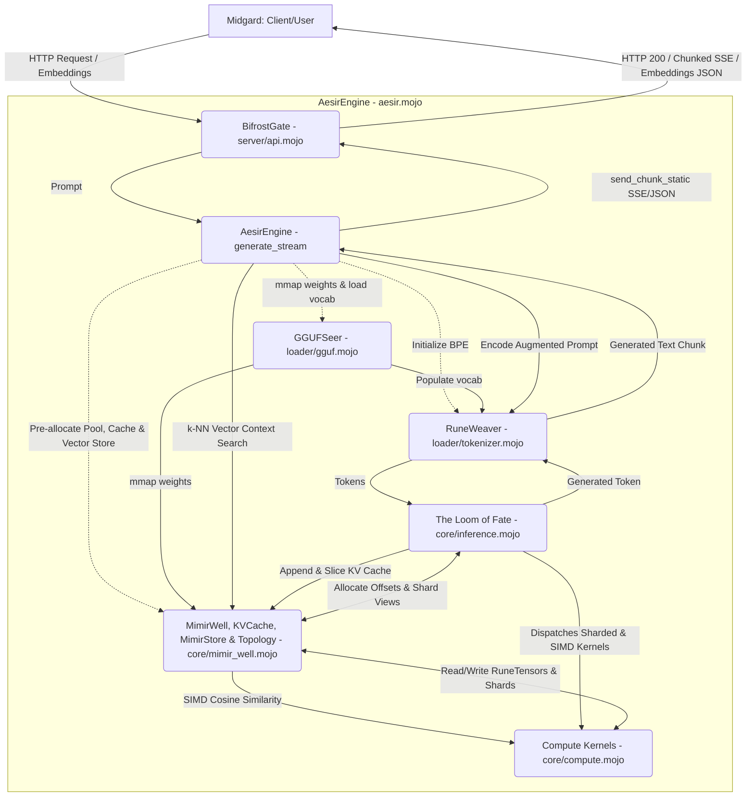

# Project Aesir: System Architecture

## The Mythic Architecture
Project Aesir adheres strictly to the Mythic Engineering methodology. The architecture is decoupled into distinct realms:

- **Midgard (The Client/User Domain):** External requests, HTTP interfaces.
- **Bifrost (The Server Layer):** The transport layer bridging Midgard to Asgard.
- **Asgard (The Engine):** The central intelligence coordinating thought, memory, and RAG context.
- **Nidavellir (The Compute Core):** Raw mathematical operations and SIMD kernels hammered into being.
- **Mímisbrunnr (The Memory Well):** Pre-allocated memory space and zero-copy vector store.

## Component Breakdown (Slice 6)

1. **`server/api.mojo` (BifrostGate, Streaming Transport & API Responses)**
   - **Role:** Bare-Metal HTTP Server (Ollama API Compatible).
   - **Responsibility:** Accepts connections, parses requests, returns JSON responses, streams output tokens real-time via `send_chunk` and `send_chunk_static`, and formats `/api/embeddings` JSON responses via `send_embeddings_response` and `send_embeddings_response_static`. Strictly decoupled from inference logic.

2. **`aesir.mojo` (AesirEngine Orchestrator, RAG & Multi-Device Topology)**
   - **Role:** The Central Intelligence (Asgard).
   - **Responsibility:** Wraps and coordinates `core` and `loader`. Holds `knowledge_base: MimirStore` for RAG prompt context retrieval (`search_knn`) and prompt augmentation (`[CONTEXT]: ...`), and `topology: DeviceTopology` for multi-device orchestration across the Bifrost Shard Matrix. Drives both single generation (`generate`) and streaming generation loops (`generate_stream`), managing token decoding and streaming payloads to `BifrostGate`.

3. **`loader/gguf.mojo` (GGUFSeer)**
   - **Role:** Zero-allocation model parser.
   - **Responsibility:** Reads GGUF file headers, KV pairs, and tensor tables, mapping weights directly into `MimirWell` via mmap and populating vocabulary into `RuneWeaver`.

4. **`loader/tokenizer.mojo` (RuneWeaver BPE Tokenizer)**
   - **Role:** Pure Mojo BPE Tokenizer.
   - **Responsibility:** Translates text into token arrays (`encode`) using byte fallbacks (`<0xXX>`) and iterative pair merging, and decodes token IDs back to text (`decode`).

5. **`core/mimir_well.mojo` (MimirWell, KVCache, MimirStore, DeviceTopology & ShardTensor)**
   - **Role:** Core Memory Management, Ring-Buffer Key-Value Cache, Vector Store & Shard Descriptors.
   - **Responsibility:** Pre-allocates contiguous RAM/VRAM pools. Forbids dynamic allocation during inference. Provides `RuneTensor` descriptors, manages `KVCache` ring buffers across transformer layers, provides `MimirStore` zero-copy vector store, `DeviceTopology` device mapping, `ShardTensor` zero-copy realm slice views, and matrix partitioning functions `shard_split_cols` and `shard_split_rows`.

6. **`core/compute.mojo` (The Forge of Nidavellir)**
   - **Role:** SIMD and parallelized runic operations & sharded compute kernels.
   - **Responsibility:** Executes Flash Attention-2, GEMM operations, RMSNorm, RoPE, activations (SiLU/GeGLU), `cosine_similarity` (SIMD vector alignment kernel), `gemm_f16_sharded` (multi-device parallel GEMM matrix multiplication), and `all_reduce_sum` (SIMD vector reduction across device shards) directly on `RuneTensor`s.

7. **`core/inference.mojo` (The Loom of Fate)**
   - **Role:** Transformer Forward Pass Execution.
   - **Responsibility:** Encapsulates `TransformerBlock` and `forward_pass()` to execute transformer layers over zero-copy memory pool slices and update `KVCache`, supporting both single-device and multi-device sharded execution paths across `topology`.

## System Map

