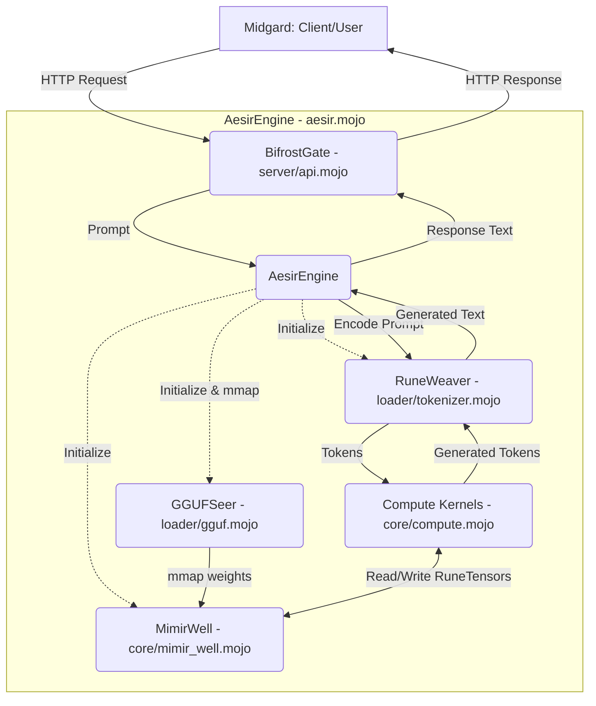

# Project Aesir: System Architecture

## The Mythic Architecture
Project Aesir adheres strictly to the Mythic Engineering methodology. The architecture is decoupled into distinct realms:

- **Midgard (The Client/User Domain):** External requests, HTTP interfaces.
- **Bifrost (The Server Layer):** The transport layer bridging Midgard to Asgard.
- **Asgard (The Engine):** The central intelligence coordinating thought and memory.
- **Nidavellir (The Compute Core):** Raw mathematical operations hammered into being.
- **Mímisbrunnr (The Memory Well):** Pre-allocated memory space, deep and still.

## Component Breakdown

1. **`server/api.mojo` (BifrostGate)**
   - **Role:** Bare-Metal HTTP Server (Ollama API Compatible).
   - **Responsibility:** Accepts connections, parses requests, and returns JSON responses. Strictly decoupled from inference logic.

2. **`aesir.mojo` (AesirEngine)**
   - **Role:** The Central Intelligence (Asgard).
   - **Responsibility:** Wraps and coordinates `core` and `loader`. Receives parsed prompts from the server, drives the inference loop, and returns generated text.

3. **`loader/gguf.mojo` (GGUFSeer)**
   - **Role:** Zero-allocation model parser.
   - **Responsibility:** Reads the ancient runes (GGUF file) and maps them directly into `MimirWell` via mmap. 

4. **`loader/tokenizer.mojo` (RuneWeaver)**
   - **Role:** BPE Tokenizer.
   - **Responsibility:** Translates Midgard's intent (text) into sacred runes (tokens) understood by the Engine.

5. **`core/mimir_well.mojo` (MimirWell)**
   - **Role:** Core Memory Management.
   - **Responsibility:** Pre-allocates a contiguous block of RAM/VRAM. Forbids dynamic allocation during inference. Provides `RuneTensor` to the compute kernels.

6. **`core/compute.mojo` (The Forge of Nidavellir)**
   - **Role:** SIMD and parallelized runic operations.
   - **Responsibility:** Executes Flash Attention-2, GEMM operations, and activations (SiLU) directly on `RuneTensor`s.

## System Map

