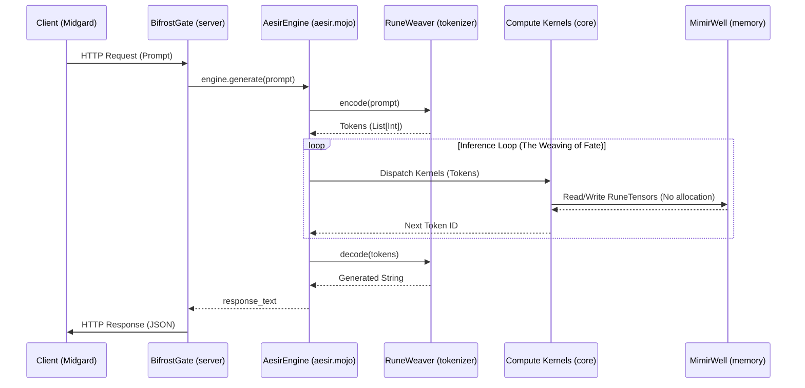

# Project Aesir: Data Flow (From Prompt to Fate)

This document traces the journey of a request through the Aesir Engine, from the moment it crosses the Bifrost to when its fate is sealed.

## The Journey of a Request

1. **The Crossing (BifrostGate)**
   - A client sends an HTTP request (Ollama API compatible) to the `BifrostGate` (`server/api.mojo`) on port 11434.
   - The gate accepts the connection and reads the raw socket bytes.
   - The transport layer extracts the string prompt and passes it to the `AesirEngine`.

2. **The Weaving (RuneWeaver)**
   - The `AesirEngine` (`aesir.mojo`) receives the prompt.
   - It invokes the `RuneWeaver` (`loader/tokenizer.mojo`) to `encode()` the text.
   - The intent of Midgard is translated into a list of integer tokens (The Runes).

3. **The Waters of Memory (MimirWell & GGUFSeer)**
   - The `GGUFSeer` (`loader/gguf.mojo`) has already mmap'd the model weights from disk directly into the `MimirWell` (`core/mimir_well.mojo`).
   - The `MimirWell` provides zero-copy `RuneTensor` pointers. There is no dynamic memory allocation during inference.

4. **The Hammering of Truth (Compute Kernels)**
   - The tokens enter the stateless sampling loop (The Weaving of Fate) in `AesirEngine`.
   - Operations are dispatched to the Forge of Nidavellir (`core/compute.mojo`).
   - `gemm_f16`, `flash_attention_2`, and `silu` kernels operate natively on `RuneTensor` objects.
   - (If `permit_seidr` is disabled, the inner thought tokens `<|start_thought|>` are masked out with -inf probability).

5. **The Return (BifrostGate)**
   - The inference loop produces new tokens, which the `RuneWeaver` decodes back into text.
   - The generated `String` is returned from `AesirEngine.generate()` back to the `BifrostGate`.
   - The `BifrostGate` packages the text into a JSON HTTP response and sends it back across the socket to the client.
   - The connection is closed. Fate is sealed.

## Sequence Diagram

