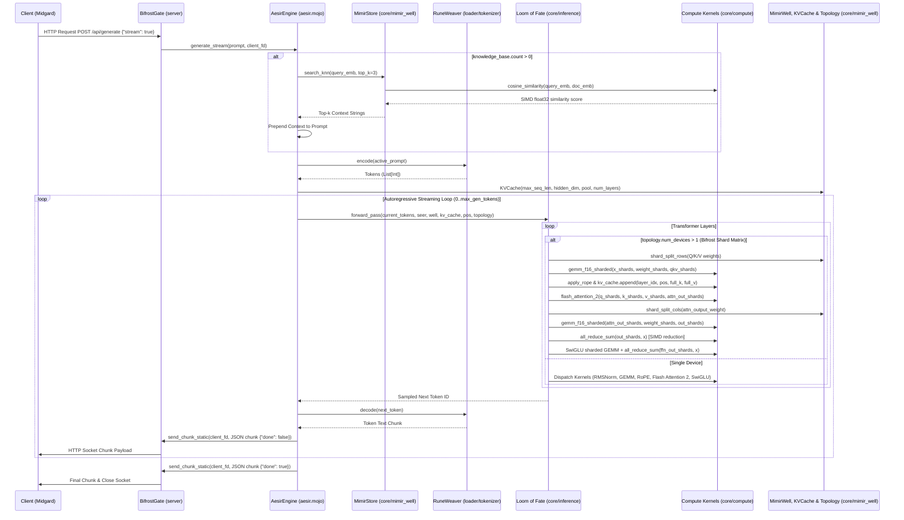

# Project Aesir: Data Flow (From Prompt to Fate)

This document traces the journey of a request through the Aesir Engine, from the moment it crosses the Bifrost to when its fate is sealed. In **Slice 6**, single-response generation (`generate`), real-time streaming output (`generate_stream`), external knowledge RAG prompt context retrieval via `MimirStore` / `cosine_similarity`, `/api/embeddings` response formatting, and multi-device matrix sharding across the **Bifrost Shard Matrix** (`DeviceTopology`, `ShardTensor`, `gemm_f16_sharded`, `all_reduce_sum`) are fully supported.

## The Journey of a Request (Slice 6)

1. **The Crossing & API Endpoints (BifrostGate)**
   - A client sends an HTTP request (Ollama API compatible) to `BifrostGate` (`server/api.mojo`) on port 11434.
   - The gate accepts the connection via `await_request()` and handles prompt execution or `/api/embeddings` response formatting (`send_embeddings_response` / `send_embeddings_response_static`).

2. **RAG Context Retrieval & Vector Search (`MimirStore` & `cosine_similarity`)**
   - `AesirEngine` (`aesir.mojo`) receives the prompt and checks `knowledge_base` (`MimirStore`).
   - If documents are stored (`count > 0`), constructs a query embedding vector in `MimirWell`.
   - Executes `knowledge_base.search_knn(query_vector, 3)`, evaluating dot products and norms using `cosine_similarity` in `core/compute.mojo`.
   - Prepends retrieved matching context chunks to the prompt string (`[CONTEXT]: ...`).

3. **The Weaving (RuneWeaver BPE Tokenizer)**
   - `AesirEngine` passes the augmented prompt to `RuneWeaver` (`loader/tokenizer.mojo`) to `encode()` text into token IDs via iterative BPE merging and byte-fallback runes (`<0xXX>`).

4. **The Waters of Memory & Topology (MimirWell, KVCache, MimirStore & DeviceTopology)**
   - `GGUFSeer` (`loader/gguf.mojo`) mmap's model weights into `MimirWell` (`core/mimir_well.mojo`) and populates `RuneWeaver` vocabulary.
   - `DeviceTopology` registers active compute device realms (`cuda:0`, `cuda:1`, etc.).
   - `KVCache` manages ring-buffer Key and Value tensor state in `MimirWell` across sequence positions up to `max_seq_len`.
   - Zero dynamic memory allocations occur during generation steps.

5. **The Autoregressive Loop & Sharded Compute Kernels (`forward_pass`)**
   - In `generate_stream()`, tokens enter `forward_pass()` in `core/inference.mojo` with `topology`.
   - For each sequence position `pos`:
     - Embeddings are retrieved and passed to `TransformerBlock` layers.
     - When `topology.num_devices > 1`:
       - Weight matrices are split via `shard_split_rows` / `shard_split_cols`.
       - Q, K, V projections run in parallel across device shards using `gemm_f16_sharded`.
       - Query and key positional representations are rotated via `apply_rope`.
       - Key and Value vectors are appended to `KVCache` at `pos`.
       - Active key/value slices are passed to column-parallel `flash_attention_2`.
       - Output and FFN down projections use `gemm_f16_sharded` followed by `all_reduce_sum` SIMD reduction into activation tensor $x$.
     - Normalization (`rmsnorm`), residual connections, and SwiGLU FFN kernels execute natively over zero-copy `RuneTensor` slices.
     - (If `permit_seidr` is disabled, reasoning tokens `<|start_thought|>` have probabilities forced to $-\infty$).

6. **Streaming Return & Socket Transmission (`BifrostGate.send_chunk_static`)**
   - Each sampled token ID is decoded back to text via `RuneWeaver.decode(next_token)`.
   - Formatted into JSON stream payloads (`{"model":"aesir","response":"...","done":false}\n`).
   - Transmitted directly across the client socket descriptor via `BifrostGate.send_chunk_static(client_fd, payload)`.
   - Upon loop completion, sends `done: true` payload and closes the stream connection.

## Sequence Diagram

