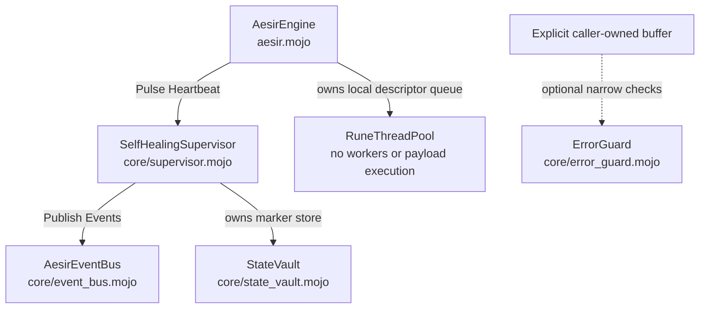
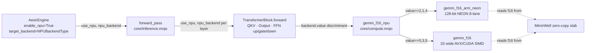
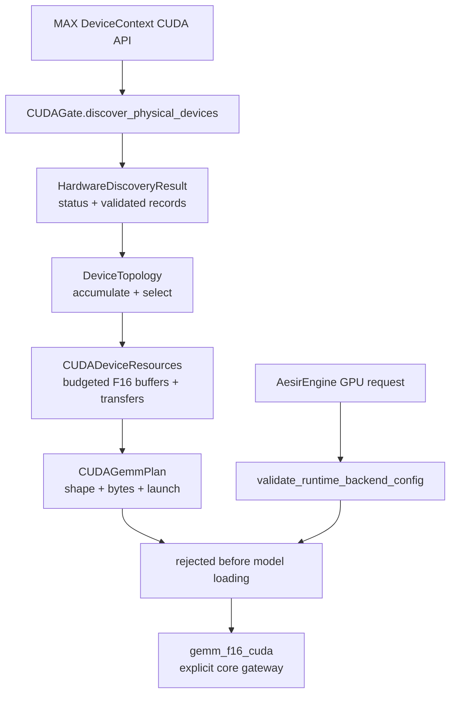
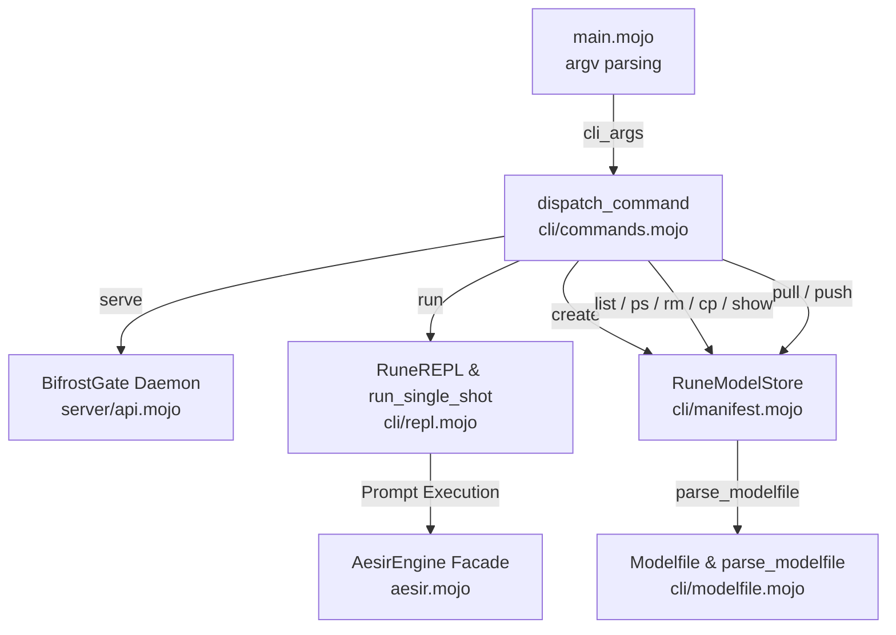
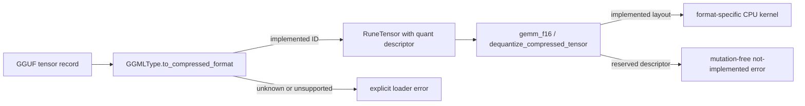
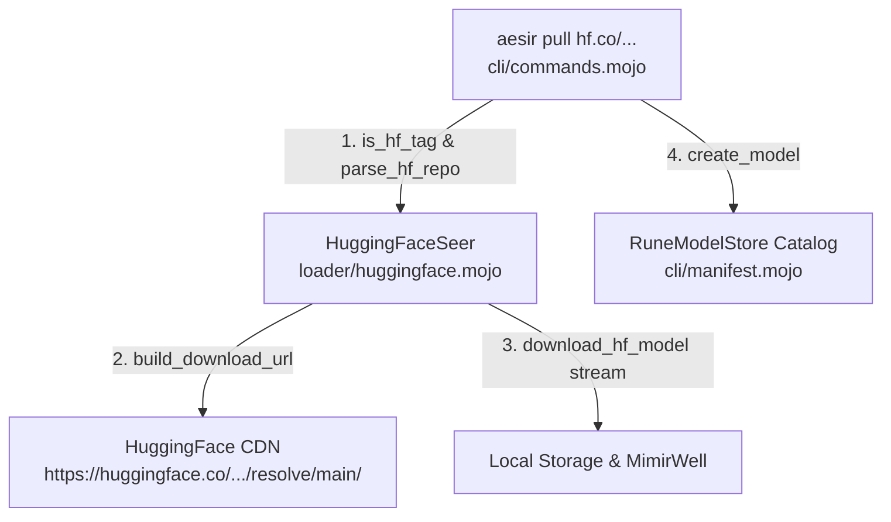

# Project Aesir: Target Architecture and Implemented Shapes

## Native local service ownership — 2026-08-31

`main` prepares process signal ownership; `cli/native_serve.mojo` owns options,
request policy and serialized orchestration. It accesses CUDA sessions through
`aesir.mojo` and the `ControlledTextSession` contract. Core owns generation
status, deadlines, reset/cancel invariants and all device execution.
`server/local_protocol.mojo` owns strict HTTP/flat JSON parsing;
`server/local_transport.mojo` owns private-key file admission, bounded loopback
sockets and descriptor lifetime. Neither transport file imports a model kernel.
The legacy `BifrostGate`/compatibility formatters are not the live service.

Both CUDA profiles have passed authenticated stateless HTTP generation,
malformed-input/slow-client rejection, deadline recovery and active shutdown.
This proves the limited [native service](NATIVE_SERVICE.md), not the distributed,
streaming, OpenAI/Ollama or multi-device aspirations retained below.


> **Status boundary — 2026-08-30:** This document mixes implemented shapes and
> target architecture. The runnable architecture is the CPU GGUF slice and the
> narrow native CUDA Gemma and Llama 3 profiles in [CURRENT_STATUS.md](CURRENT_STATUS.md).
> Server, distributed, NPU, multi-GPU, compatibility, and broad accelerator
> diagrams below are aspirations unless the capability ledger explicitly says
> otherwise.

> *"Order is not accidental. It is built by design laws that endure under load."*  
> — **Rúnhild Svartdóttir, The Architect**

---

## 🏗️ Architectural Overview

Project Aesir is a bare-metal LLM inference engine written in **Mojo**. 

> [!IMPORTANT]
> **Executable Status Alignment**: Present-tense execution is governed by [`CAPABILITY_LEDGER.md`](../CAPABILITY_LEDGER.md). The tested paths include the pinned CPU Llama F16 slice and native CUDA Gemma 4 E4B text inference. Other diagrams below retain target/legacy vocabulary and do not prove general GPU, NPU, service or distributed execution.

The native CUDA path is `main → cli/cuda_chat → aesir.Gemma4CUDASession`.
`loader/packed_gguf.mojo` owns validated packed tensor offsets and mmap lifetime;
`loader/gemma4_tokenizer.mojo` owns model-driven BPE and text-chat framing.
`core/gemma4_cuda.mojo` owns the device context, one-time packed-weight upload,
persistent device activations/KV, context admission, autoregression and decoding.
`core/gemma4_kernels.mojo` contains the actual GPU model operations. CLI code
owns input and transcript I/O only. Device errors poison the session and do not
select a CPU fallback. See [the verified profile and limits](GEMMA4_CUDA.md).

The Llama 3 route uses the same CLI/facade boundary with `--profile llama3` and
`Llama3CUDASession`. `loader/llama3_tokenizer.mojo` owns Unicode-aware byte BPE
and explicit Llama chat controls; `core/llama3_cuda.mojo` owns the admitted
32-layer profile, F16 KV and remaining-context policy. `llama3_kernels.mojo`
implements adjacent-pair RoPE, SiLU and 32-query/8-KV-head scaled attention,
reusing the validated packed matvec/norm primitives from `gemma4_kernels.mojo`.
See [STHENO_CUDA.md](STHENO_CUDA.md). Neither session is the legacy
`AesirEngine` accelerator-dispatch scaffold.

---

## 🧩 Target Subsystem Architecture

```mermaid
graph TD
    Client[Midgard: Client / HTTP Request] -->|Port 11434 POSIX Socket| Gate(server/api.mojo - BifrostGate)
    
    subgraph Asgard [AesirEngine Orchestrator - aesir.mojo]
        Gate -->|String Prompt| Engine(AesirEngine)
        Engine -.->|1. Pre-allocate VRAM/RAM Pool| Memory(core/mimir_well.mojo - MimirWell, KVCache & MimirStore)
        Engine -.->|2. mmap & parse GGUF| Seer(loader/gguf.mojo - GGUFSeer)
        Engine -.->|3. Initialize BPE Tokenizer| Weaver(loader/tokenizer.mojo - RuneWeaver)
        
        Seer -->|Direct Weight Mapping| Memory
        Seer -->|Populates Vocabulary| Weaver
        
        Engine -->|4. RAG Context Lookup (k-NN)| Memory
        Memory -->|5. SIMD Cosine Similarity| Kernels(core/compute.mojo - cosine_similarity)
        
        Engine -->|6. Encode Augmented Prompt| Weaver
        Weaver -->|Token IDs| Loom(core/inference.mojo - forward_pass)
        
        Loom -->|Append/Slice Keys & Values| Memory
        Loom -->|Dispatches Layers| Kernels
        
        Kernels <-->|Zero-Copy RuneTensors| Memory
        Loom <-->|Allocate Pool Offsets| Memory
        
        Loom -->|Sampled Next Token| Weaver
        Weaver -->|Decoded String Chunk| Engine
        Engine -->|send_chunk_static SSE/JSON| Gate
    end
    
    Gate -->|HTTP 200 OK / Chunked Stream / Embeddings JSON| Client
```

---

## 🔒 Target Domain Layering & Existing Component Shapes

### 1. `server/api.mojo` — `BifrostGate` (Transport & Response Formatting)
- **Role:** Bare-metal HTTP socket listener, streaming transport, and API response formatting engine.
- **Implementation:** Uses libc POSIX syscalls (`socket`, `bind`, `listen`, `accept`, `send`, `close`). Provides `send_chunk` / `send_chunk_static` to stream raw HTTP chunked / SSE data directly to client socket file descriptors (`client_fd`) as tokens are generated, and `send_embeddings_response` / `send_embeddings_response_static` to format and return Ollama-compatible `/api/embeddings` JSON payloads (`{"model":"aesir","embedding":[...]}`).
- **Memory Safety:** Employs explicit string lifetime management (`_ = chunk.unsafe_ptr()`) to keep buffers alive past async `send` syscalls.

### 2. `aesir.mojo` — `AesirEngine` (Orchestrator, RAG, Resilience, Multi-Device Topology, NPU Gateway & GPU Matrix)
- **Role:** Sovereign facade coordinating intelligence, memory, vector stores, resilience guardians, multi-device topology, NPU backend selection, GPU realm targeting, and transport streaming.
- **Resilience descriptors (Slice 12):** Holds `supervisor: SelfHealingSupervisor`, `event_bus: AesirEventBus`, and `thread_pool: RuneThreadPool`. Initialization records a local heartbeat marker. The supervisor is a labeled simulation and the thread-pool type is a bounded task descriptor queue with no workers; neither provides process recovery or concurrency.
- **Topology & bounded RAG primitives:** Holds `knowledge_base: MimirStore` and a validated single-device `topology`. If callers populate the in-memory store with real embeddings, `generate()` and `generate_stream()` can mean-pool the loaded model's `token_embd.weight` rows, run local cosine top-k search, apply a 1024-byte context cap, and prepend citation-shaped text. Missing weights, empty token sequences, dimension mismatches, and out-of-range token IDs fail explicitly. This is a partial local RAG path: the facade's raw-text ingestion method is unavailable because no independent embedding pipeline, durable index, or citation-provenance store exists. Multi-device engine execution is rejected during configuration.
- **Thinking controls:** The legacy CPU generation path can suppress one configured start token. Separately, `ThinkingController` performs bounded output redaction for literal `<think>...</think>` blocks across split token text (`AES-GEN-010`). Neither mechanism proves that reasoning computation was prevented, and the redactor is not integrated into native CUDA streaming.
- **NPU Realm Gateway (Slice 7):** Holds `enable_npu: Bool` and `target_backend: NPUBackendType` fields. When `enable_npu` is `True`, logs the active NPU backend name (`target_backend.name()`) during initialization and passes `use_npu=enable_npu, npu_backend=target_backend` into every `forward_pass()` invocation.
- **Universal Multi-GPU Realm Matrix (Slice 8):** Holds `enable_gpu_realm: Bool` and `target_gpu_realm: GPURealmType` fields. When `enable_gpu_realm` is `True`, logs the active GPU realm name (`target_gpu_realm.name()`) during initialization and passes `use_gpu_realm=enable_gpu_realm, gpu_realm=target_gpu_realm` into every `forward_pass()` invocation, routing GEMM operations through `gemm_f16_gpu` in `core/compute.mojo`.

### 3. `loader/gguf.mojo` — `GGUFSeer`
- **Role:** Zero-allocation model parser, weight mapper, and binary security fuzzing boundary.
- **Implementation:** `mmap`s model files directly from disk into address space. Reads 24-byte binary GGUF headers (`magic` `0x46554747`, `version`, `tensor_count`, `kv_count`), walks KV pairs using `skip_value`, populates `RuneWeaver` vocabulary from `tokenizer.ggml.tokens`, and populates tensor metadata dictionary mapping quantized blocks into `MimirWell`. Uses portable little-endian byte-reconstruction (`_read_u32`, `_read_i32`, `_read_u64`, `_read_f32`) for cross-platform endian safety (`AES-LDR-005`). Provides generic memory pointer buffer parser `parse_header_bytes()` for binary stream fuzzing boundary validation (`AES-OPS-003`).

### 4. `loader/tokenizer.mojo` — `RuneWeaver` (BPE Tokenizer)
- **Role:** Pure Mojo Byte-Pair Encoding (BPE) Tokenizer.
- **Implementation:** Translates human text into token arrays (`encode`) and back (`decode`). Features vocabulary lookup maps (`token_to_id`), byte-fallback token formatting (`<0xXX>`), and iterative pair merging. Completely independent of Python or external runtimes.

### 4.1. `loader/corpus_ingestion.mojo` — Deterministic Corpus Ingestion & Text Chunking
- **Role:** Partial text chunking and caller-embedded batch ingestion primitive (`AES-RAG-004`).
- **Implementation:** Provides `DocumentChunk`, a deterministic overlapping byte-window chunker, exact mean pooling over caller-supplied token tables, and transactionally validated matrix-to-store copying. It never derives embeddings from hashes or constants. File parsing, arbitrary UTF-8 boundary proof, embedding-model execution, persistence, and provenance remain unavailable.

### 4.1a. `loader/chat_template.mojo` — Chat Template Formatting
- **Role:** Structured chat message formatting for multi-turn conversations.
- **Implementation:** Provides `ChatMessage` struct (role + content), `ChatTemplate` with system/user/assistant role markers, and `format_chat_prompt()` for rendering multi-turn conversations into model-compatible prompt strings. Supports ChatML, Llama, and custom template formats.

### 4.2. `loader/quantization.mojo` — Quantization Byte Span Bounds Validation & Format Metadata
- **Role:** Upstream GGML block size calculation, weights-per-block metrics, and input byte span validation (`AES-QNT-002`).
- **Implementation:** Provides `get_block_size_bytes()`, `get_weights_per_block()`, and `validate_quantized_byte_span()` to enforce exact byte span alignment ($bytes == num\_blocks \times 144$) and reject unaligned or non-divisible byte buffer lengths before execution.

### 4.3. `loader/onnx.mojo` — bounded ONNX protobuf metadata parser
- **Role:** Safe file/in-memory `ModelProto` metadata decoding and explicit separation from unavailable ONNX execution (`AES-ECO-004`).
- **Implementation:** Opens final paths with `O_NOFOLLOW`, read-only maps files, bounds every protobuf field, validates metadata UTF-8, extracts actual IR/producer/default opset values and graph node descriptors, and rejects malformed input or operator names outside its recognized metadata subset. It does not decode initializers or execute graphs; `map_to_well()` fails explicitly.

### 4.4. `loader/exl2.mojo` — EXL2 descriptor and unavailable runtime boundary
- **Role:** Preserve validated caller-owned bitrate descriptors while refusing nonexistent EXL2 parsing or execution (`AES-ECO-005`).
- **Implementation:** `EXL2ModelSeer` starts with zero metadata, rejects the formerly invented `EXL2` magic-header path, validates explicit 2..8 bpw descriptor inputs and calculates their weighted average. Config/safetensors parsing, tensor mapping, conversion and CUDA execution all remain unsupported.

### 5. `core/mimir_well.mojo` — `MimirWell`, `RuneTensor`, `KVCache`, `PagedKVCache`, `MimirStore`, `DeviceTopology`, `ShardTensor`, `NPUBackendType`, `NPUBuffer`, `GPURealmType` & `GPUBuffer`
- **Role:** Central contiguous memory manager, zero-allocation Key-Value cache pool, vector store, multi-device realm sharding descriptors, NPU buffer allocation, and GPU realm buffer management.
- **Implementation:** 
  - `MimirWell`: Pre-allocates a single contiguous memory block using `alloc` and provides `allocate()` for zero-copy pointer slice offsets. In **Slice 7**, provides `allocate_npu_buffer(size_bytes, backend)`. In **Slice 8**, provides `allocate_gpu_buffer(size_bytes, realm)` to carve zero-copy physical GPU stream channels directly from the pool.
  - `RuneTensor`: Zero-copy tensor structure providing `get_checked()` and `set_checked()` out-of-bounds indexing safety guards and `is_borrowed()` / `is_owned()` lifetime descriptor getters.
  - `KVCache`: Ring-buffer KV cache managing pre-allocated `RuneTensor[f16]` buffers for Key ($K$) and Value ($V$) tensors across `max_seq_len` (e.g., 2048/4096 tokens) and `num_layers`. Provides `append()`, `get_k_slice()`, and `get_v_slice()`.
  - `PagedKVCache`: bounded host page manager dividing preallocated K/V storage into configurable fixed-size physical blocks. Per-sequence logical page tables, owner maps, per-layer initialized lengths, checked translation, exhaustion, tail/sequence release, and reuse are implemented. Attention/session integration, scheduling, eviction, shared-prefix reference counts/copy-on-write, GPU pages, and fragmentation measurements remain separate work (`AES-MEM-004`).
  - `MimirStore`: Vector store pre-allocating zero-copy memory inside `MimirWell`. Holds document text chunks (`List[String]`) and embedding matrix `embeddings` (`RuneTensor[f16]`). Provides `add_document()`, `clear()`, and `search_knn()` for k-NN vector retrieval with capacity and dimension boundary validation (`AES-RAG-002`).
  - `DeviceTopology` & `ShardTensor`: Map hardware compute devices (`cuda:0`, `cuda:1`, etc.) and wrap zero-copy `RuneTensor[f16]` slices bound to individual device realms. Provides `probe_all_hardware()`, `require_npu_backend()`, and `require_gpu_realm()` to separate configured from discovered physical backends and strictly reject absent accelerator requests with explicit error exceptions instead of claiming CPU as hardware execution (`AES-ACC-003`).
  - Partitioning Functions: `shard_split_cols()` (column-parallel matrix splitting), `shard_split_rows()` (row-parallel matrix splitting), and `shard_split_gqa_heads()` (multi-device Grouped-Query Attention Q/K/V head partitioning with head divisibility validation) (`AES-ACC-004`).
  - **`NPUBackendType` & `NPUBuffer` (Slice 7):** Zero-overhead integer discriminant tag naming six edge NPU spirits and DMA-BUF zero-copy shared memory conduit. Provides `validate_zero_copy_contract()` to enforce OS DMA-BUF / mmap handle evidence before zero-copy access (`AES-ACC-009`).
  - **`GPURealmType` (Slice 8):** Zero-overhead integer discriminant tag naming ten global compute GPU hardware realms: `NVIDIA_CUDA (0)`, `AMD_ROCM_HIP (1)`, `INTEL_ONEAPI_XE (2)`, `MOORE_THREADS_MUSA (3)`, `BIREN_SUPA (4)`, `METAX_MACA (5)`, `HYGON_DCU (6)`, `ARM_MALI_OPENCL (7)`, `QUALCOMM_ADRENO (8)`, `IMAGINATION_POWERVR (9)`. Provides `.name()`, `==`, and `!=`. Default: `NVIDIA_CUDA (0)`.
  - **`GPUBuffer` (Slice 8):** Zero-copy physical GPU memory buffer descriptor establishing unified physical memory frame sharing between host MMU and GPU page tables. Fields: `ptr`, `size_bytes`, `handle_fd`, `realm: GPURealmType`. Provides `.as_rune_tensor(rows, cols)` for zero-copy `RuneTensor` interop and `validate_zero_copy_contract()` to enforce OS DMA-BUF / mmap handle evidence before zero-copy access (`AES-ACC-009`).

### 7. `aesir_engine/config.mojo` & System Paradigms (`skaldbrodir`, `thinking`, `tool_use`, `smart_crash`, `max_gate`, `cia`, `wic`, `nsfi`, `mqari`, `help`, `tui`)
- **Role:** Configuration intent and a mixture of bounded local helpers and reserved experimental surfaces; the capability ledger defines which execute.
- **Components:**
  - `AesirConfig`: Human-readable JSON configuration manifest (`aesir.config.json`).
  - `SkaldbrodirDetector`: Bounded exact-period scoring over a token-ID suffix. It emits soft/hard intervention signals and raises `INF-016` after two terminal-threshold observations. It does not compute entropy, modify logits, or affect generation until a runtime explicitly consumes it.
  - `ThinkingController`: Streaming text redaction for one literal thought-block convention, with split-marker buffering and malformed-block rejection (`AES-GEN-010`).
  - `ToolDefinition` / `ToolCall`: Strict bounded JSON schema formatting and exact tool-call parsing (`AES-GEN-011`). No tool execution or generation-loop integration exists.
  - `SmartCrashReporter`: Validated in-memory caller-reported failure counter and deterministic diagnostic formatter (`AES-RES-006`). Reports state that no recovery action occurred; it does not intercept crashes, persist logs, switch hardware, restart a process, or call AI.
  - `MAXGate`: Legacy unavailable graph gateway. It reports no devices and rejects without mutating output; real MAX CUDA work uses the selected-device resource and executor modules.
  - `EpisodicComputationMemory`: Reserved CIA surface; semantic state hashing/storage/lookup are unavailable and raise.
  - `WaveInferenceEngine`: Reserved WIC surface; no wave solver or inference transform is implemented.
  - `NSFIEngine`: Reserved NSFI surface; no trained representation or weight reconstruction is implemented.
  - `MQARIEngine`: Reserved MQARI surface; no physical acoustic/quantum operation or model projection is implemented.
  - `AesirTUIDashboard`: Validates and formats explicitly caller-observed runtime snapshots with source and timestamp provenance. With no observation it reports metrics unavailable; it does not inspect hardware or measure throughput itself.

### 6. `core/compute.mojo` — Nidavellir SIMD Kernels, Sharded Operations, NPU Gateway & GPU Realm Dispatch
- **Role:** Hardware SIMD compute kernels, vector similarity alignment, sharded matrix algebra, NPU backend dispatch, and GPU realm matrix multiplication.
- **Kernels:**
  - `gemm_f16`: 32x32 block-tiled matrix multiplication.
  - `flash_attention_2`: Fused $QK^T$, online streaming softmax ($m_i, l_i$), and $V$ accumulation.
  - `silu` & `geglu`: Vectorized activation functions.
  - `packed_value`, `dequantize_ggml_k` & `dequantize_compressed_tensor`: direct canonical GGML byte addressing for Q2_K, Q3_K, Q4_K, Q5_K, and Q6_K 256-value blocks (`AES-QNT-002`, `AES-QNT-006`, `AES-QNT-008`). The dispatcher and `gemm_f16()` require complete blocks and reject unknown or reserved formats. `quantization_autotuner.mojo` separately owns opt-in Linux host measurement, correctness gating, and bounded exact-shape selection caching; it does not alter automatic inference dispatch (`AES-QNT-003`, `AES-QNT-011`).
  - `rmsnorm`: Vectorized Root Mean Square normalization with learned scale weights.
  - `apply_rope`: Rotary Position Embeddings in complex space across queries and keys.
  - `cosine_similarity`: SIMD-vectorized cosine similarity kernel ($\frac{A \cdot B}{\max(\|A\| \cdot \|B\|, 10^{-8})}$) using `simd_w_f16` vector lanes and unaligned tail loop with `isnan` and `isinf` error checks returning `0.0` for corrupt/zero-vector inputs (`AES-RAG-001`).
  - `gemm_f16_sharded` & `all_reduce_sum`: Multi-device parallel GEMM and SIMD vector reduction across Bifrost Shard Matrix.
  - **`gemm_f16_arm_neon`, `rmsnorm_arm_neon` & `gemm_f16_npu` (Slice 7):** 128-bit ARM NEON kernels and NPU Realm Gateway dispatcher.
  - **GPU-named host helpers (Slice 8):** `gemm_f16_gpgpu_vector` and `gemm_f16_mobile_opencl` are host SIMD functions retained for compatibility; their names do not prove vendor GPU execution.
  - **`gemm_f16_cuda`:** Real resource-explicit CUDA F16 GEMM gateway. It requires a reusable selected-device `CUDAF16GemmExecutor`; it never discovers hardware, invents budgets, or falls back to host compute.
  - **`rmsnorm_gpu` and `gemm_f16_gpu`:** The older realm-only gateways remain fail-closed for every realm because they carry no selected resource owner. CUDA discovery never authorizes a CPU fallback under a GPU label.

### 6.1. `core/cuda_gate.mojo`, `metal_gate.mojo`, `intel_gate.mojo`, `amd_gate.mojo`, `npu_gate.mojo` — Hardware Runtime Gate Probes
- **Role:** Backend-specific GPU/NPU runtime discovery, driver availability probes, and hardware-specific kernel launchers.
- **Implementation:**
  - `CUDAGate` (`cuda_gate.mojo`): NVIDIA CUDA runtime probe with `is_cuda_available()`, dynamic `libcuda.so` / `nvcuda.dll` presence detection, and fail-closed error boundaries for missing CUDA drivers.
  - `MetalGate` (`metal_gate.mojo`): Apple Metal runtime probe with `is_metal_available()`, macOS Metal framework detection, and fail-closed boundaries for non-Apple platforms.
  - `IntelGate` (`intel_gate.mojo`): Intel OneAPI Level Zero runtime probe with `is_intel_available()`, `libze_loader.so` presence detection, and fail-closed boundaries for missing Intel GPU drivers.
  - `AMDGate` (`amd_gate.mojo`): AMD ROCm HIP runtime probe with `is_amd_available()`, `libamdhip64.so` presence detection, and fail-closed boundaries for missing AMD GPU drivers.
  - `NPUGate` (`npu_gate.mojo`): Edge NPU runtime probe with backend-specific library detection (`libhailort.so`, `libQnnHtp.so`, etc.) and fail-closed boundaries for unavailable NPU hardware.
- **Boundary:** All gate files are in `core/` (Core — Hardware Discovery Domain). They have zero imports from `server/`, `cli/`, or `loader/`.

### 7. `core/inference.mojo` — The Loom of Fate (`TransformerBlock`, `forward_pass` & `generation_stop_reason`)
- **Role:** Transformer layer pipeline execution with multi-device topology, NPU backend, GPU realm dispatch support, and exception-safe arena offset restoration.
- **Implementation:** Encapsulates `TransformerBlock` and `forward_pass()`. Features try-catch workspace pool offset restoration (`well.reset_kv_cache(start_offset)`) around single-device and multi-device execution paths, preventing workspace arena leakage or offset drift under layer exceptions (`AES-MEM-005`). `TokenCandidate` in `core/sampler.mojo` and `SessionContext` in `core/session.mojo` conform to `ImplicitlyCopyable` for zero-copy collection passing (`AES-GEN-009`).
- **GPU Dispatch (Slice 8):** `TransformerBlock.forward()` accepts `use_gpu_realm: Bool` and `gpu_realm: GPURealmType`. When `use_gpu_realm` is `True` on the single-device path, all GEMM calls (QKV, output projection, FFN up/gate/down) are dispatched through `gemm_f16_gpu(…, gpu_realm)`. `forward_pass()` threads `use_gpu_realm` and `gpu_realm` into every layer block and into the final vocabulary projection.

### 8. `cli/` & `main.mojo` — The Ollama CLI, REPL Terminal Suite & llama.cpp CLI Compat (Slice 9 & Slice 25)
- **Role:** Sovereign command-line entry point (`main.mojo`), command routing dispatcher (`cli/commands.mojo`), Modelfile directive parser (`cli/modelfile.mojo`), model catalog & manifest store (`cli/manifest.mojo`), interactive chat REPL terminal session (`cli/repl.mojo`), llama.cpp CLI unavailable boundary (`cli/llama_cpp_compat.mojo`), CLI flag/option parser (`cli/options.mojo`), and help/TUI dashboard (`cli/help.mojo`, `cli/tui.mojo`).
- **Implementation:** Dispatches 12 standard Ollama commands (`serve`, `run`, `pull`, `push`, `create`, `list`/`ls`, `ps`, `rm`/`delete`, `cp`, `show`, `stop`, `help`). Features `remove_model_checked()` in `RuneModelStore` providing active model-in-use protection and non-existent model error guards (`AES-CLI-005`). The reserved `cli/llama_cpp_compat.mojo` surface rejects every subcommand and argument vector; no detached flag parser is presented as llama.cpp compatibility (`AES-ECO-006`).

### 9. `core/error_guard.mojo`, `state_vault.mojo`, `event_bus.mojo`, `thread_pool.mojo`, `supervisor.mojo` — Sovereign Resilience Matrix (Slice 12 & Slice 28)
- **Role:** Durable checkpoint records, local event/task descriptors, an unavailable supervisor recovery boundary, and defensive pointer/logit helpers. Process recovery and worker concurrency are unavailable.
- **Implementation:**
  - `ErrorGuard`: Null/address-one rejection (`validate_pointer`), one-index boundary checking (`bounds_check`), and caller-owned Float16 NaN/Inf replacement (`sanitize_logits`). It cannot prove pointer provenance, span, alignment, or lifetime.
  - `StateVault`: Strict versioned persistence for token-position and prompt-count markers, with a corruption checksum, staged file sync, atomic replacement, directory sync, and transactional in-memory publication (`AES-RES-002`). It contains no model, tensor, KV, sampler, process, or socket state.
  - `AesirEventBus`: Bounded synchronous in-process event journal and masked subscriber mailboxes with ordered drain and unsubscribe (`AES-RES-003`). It owns no worker or cross-process transport.
  - `RuneThreadPool`: Bounded local `RuneTask` descriptor list with validated submission, pre-execution cancellation, and admission shutdown (`AES-RES-004`). Worker and batch execution methods reject without marking tasks complete.
  - `SelfHealingSupervisor`: Records a local heartbeat event; its legacy recovery method rejects without mutation because no panic or runtime recovery owner exists.

### 10. `loader/huggingface.mojo` — `HuggingFaceSeer` (Slice 13)
- **Role:** Hugging Face public-repository identity validation, pinned resolve-URL construction, and verified GGUF file download orchestration.
- **Implementation:** `parse_hf_repo` normalizes the exact `hf.co` and `huggingface.co` forms. `is_hf_tag` requires one safe `owner/name` identity and rejects unrelated schemes/hosts and malformed paths. `download_hf_model` invokes `curl` and `sha256sum` through checked argv, enforces HTTPS-only redirects, an immutable 40-hex revision, expected size, SHA-256, GGUF v3 header, bounded optional ranges, and exclusive atomic file publication. It writes one public GGUF to disk; it does not populate `MimirWell`, register the model, authenticate, resume, or establish compatibility with any architecture merely named by a repository.

### 11. `server/api.mojo` & `server/openai.mojo` — Bifrost Gate Server & Gateway (Slice 10 & 11)
- **Role:** HTTP transport framing, POSIX socket server, OpenAI REST API endpoint routing, request correlation tracking, and JSON string escaping.
- **Implementation:** Provides `json_escape_string()` for safe JSON payload serialization across quotes, backslashes, tabs, control characters, and Unicode (`AES-SRV-003`). `OpenAIGate` bounds and escapes caller-observed response data and requires real identity, timestamp, model, finish reason, and usage inputs rather than filling operational fields with constants (`AES-SRV-005`). Encapsulates `RequestContext` (correlation ID, session binding, timeout_ms, cancellation) and `build_structured_error()` for structured JSON error payloads (`AES-SRV-004`). Implements `build_http_response()`, `build_sse_chunk()`, `build_http_chunk()`, `unsupported_http_response()`, and `route_not_found_response()`. The legacy OpenAI-shaped routes remain HTTP 501 and separate from the authenticated native service.

---

## 🛡️ Local Resilience Primitives — Slice 12 Domain Layer

This domain provides narrow local checks, restart-safe position markers, bounded synchronous event mailboxes, task descriptors, and an explicit unavailable recovery boundary. It does not provide zero downtime, crash interception, runtime restoration, concurrency, or socket continuity.



**Resilience Matrix Components:**

1. **`ErrorGuard` (`core/error_guard.mojo`):**
   - `validate_pointer`: Rejects only null and address-one sentinels; ownership, span, alignment, and lifetime remain caller obligations.
   - `bounds_check`: Tests whether one index satisfies $0 \le \text{index} < \text{max\_len}$.
   - `sanitize_logits`: Scans a caller-owned Float16 buffer and replaces NaN or infinite values with $-65504.0$; sentinel pointers and nonpositive counts raise.

2. **`StateVault` (`core/state_vault.mojo`):**
   - Captures sequence and prompt-count markers with a positive timestamp and corruption checksum.
   - Disk records have a strict 4 KiB/versioned format and commit through staged sync, atomic rename, and directory sync on Linux.
   - Restore returns a validated position marker only; it does not restore any runtime object or claim a latency bound.

3. **`AesirEventBus` (`core/event_bus.mojo`):**
   - Synchronously journals bounded local event records and copies them to matching in-memory subscriber mailboxes.
   - Supports the built-in `HEARTBEAT`, `MODEL_LOADED`, `INFERENCE_CRASH`, and `RECOVERY_COMPLETE` mask bits plus a custom-event bit.

4. **`RuneThreadPool` (`core/thread_pool.mojo`):**
   - Stores bounded caller task descriptors and cancellation state. It creates no threads and executes no work.

5. **`SelfHealingSupervisor` (`core/supervisor.mojo`):**
   - Records a local heartbeat event and owns a marker store. It catches no panic, restarts no process, restores no runtime state, and provides no socket continuity.

---

## ⚙️ Hardware & Compiler Requirements

- **Compiler:** Mojo 24.x / Modular SDK via `pixi`.
- **Target OS:** Linux x86_64.
- **Hardware Acceleration:** AVX-512 / ARM NEON SIMD vectorization (Slice 7 adds explicit ARM NEON 128-bit kernels for edge targets; Slice 8 adds 16-wide GPGPU and 8-wide Mobile GPU SIMD kernels).
- **Edge NPU Targets (Slice 7):** Hailo-10 (dataflow bridge pending), Qualcomm Hexagon HTA/HVX (bridge pending), ARM Cortex-A NEON (active), NVIDIA Jetson (CUDA + NEON host fallback), Apple Neural Engine (Core ML bridge pending), Generic NPU (universal SIMD fallback).
- **GPU Hardware Realms (Slice 8):** NVIDIA CUDA, AMD ROCm HIP, Intel OneAPI Xe, Moore Threads MUSA, Biren SUPA, MetaX MACA, Hygon DCU, ARM Mali OpenCL, Qualcomm Adreno, Imagination PowerVR.

---

## 🌐 The NPU Realm Gateway — Slice 7 Domain Layer

The NPU Realm Gateway is a hardware abstraction sub-layer within the `core` domain. It provides a **zero-overhead, zero-heap, zero-vtable** path from `AesirEngine`'s configuration to hardware-specific GEMM execution across six edge silicon architectures.



---

## 🌌 The Universal GPU Realm Matrix — Slice 8 Domain Layer

This layer separates requested realm names, observed hardware, explicit
resource ownership, and model integration. GPU-1 provides real MAX CUDA
enumeration and validated topology selection; GPU-2 owns selected contexts,
buffers, transfers, and synchronization; GPU-3 owns one real explicit F16 GEMM.
Transformer inference, persistent device weights, the realm-only gateway, and
CLI acceleration remain unsupported.



**Boundary confirmation for Slice 8:**

| Component | Placed in | Domain | Verdict |
| :--- | :--- | :--- | :--- |
| `GPURealmType` | `core/mimir_well.mojo` | Core — Memory & Type Domain | ✅ **Correct** — hardware discriminant type belongs in core memory/topology |
| `GPUBuffer` | `core/mimir_well.mojo` | Core — Memory & Type Domain | ✅ **Correct** — reserved host descriptor belongs beside `MimirWell` |
| discovery records and `DeviceTopology` | `core/mimir_well.mojo` | Core — Memory & Topology Domain | ✅ **Correct** — runtime-neutral records and selection belong in topology |
| `CUDAGate` MAX adapter | `core/cuda_gate.mojo` | Core — CUDA Runtime Boundary | ✅ **Correct** — CUDA-specific enumeration stays behind its gate |
| `CUDAGemmPlan` | `core/cuda_gemm_plan.mojo` | Core — CUDA Planning Domain | ✅ **Correct** — hardware-independent admission stays outside topology and kernel execution |
| `CUDAF16GemmExecutor` | `core/cuda_compute.mojo` | Core — CUDA Compute Domain | ✅ **Correct** — owned transfers, kernel launch, synchronization, and reuse remain behind one explicit owner |
| GPU compute gateways | `core/compute.mojo` | Core — Compute Domain | ✅ **Correct** — real resource-explicit CUDA GEMM and fail-closed realm-only boundaries remain in compute |
| `TransformerBlock.forward()` GPU params | `core/inference.mojo` | Core — Inference Domain | ✅ **Correct** — inference layer owns layer dispatch decisions |
| `AesirEngine.enable_gpu_realm`, `target_gpu_realm` | `aesir.mojo` | Asgard Facade Domain | ✅ **Correct** — configuration knobs belong in orchestration facade |

**Current evidence boundary:** server, loader, facade, and Transformer inference
do not own or invoke the CUDA GEMM executor. The opt-in physical tests prove one
explicit GEMM on one observed RTX/MAX host, not model inference, persistent
device weights, other operators/backends, general CUDA portability,
performance, or hardware CI.

---

## ⚡ The Ollama CLI & REPL Terminal Suite — Slice 9 Domain Layer

The Ollama CLI & REPL Terminal Suite completes Project Aesir's drop-in compatibility with the Ollama CLI experience. It allows users to invoke `aesir` directly from terminal shell environments to manage models, parse Modelfiles, run interactive chat sessions, or host the `BifrostGate` API daemon.



**Boundary confirmation for Slice 9:**

| Component | Placed in | Domain | Verdict |
| :--- | :--- | :--- | :--- |
| `Modelfile` & `parse_modelfile` | `cli/modelfile.mojo` | CLI — Configuration Parsing | ✅ **Correct** — Modelfile syntax parser belongs in CLI domain |
| `ModelManifest` & `RuneModelStore` | `cli/manifest.mojo` | CLI — Catalog Domain | ✅ **Correct** — model catalog & manifests belong in CLI domain |
| `RuneREPL` & `run_single_shot` | `cli/repl.mojo` | CLI — REPL Domain | ✅ **Correct** — terminal chat loop belongs in CLI domain |
| `dispatch_command` | `cli/commands.mojo` | CLI — Command Gateway | ✅ **Correct** — CLI command router belongs in CLI domain |
| `main()` entry point | `main.mojo` | CLI — Entry Point | ✅ **Correct** — binary entry point delegates directly to dispatcher |

**No boundary violations detected.** `cli/` modules maintain complete isolation from `core/compute.mojo`, `core/inference.mojo`, and `core/mimir_well.mojo`. Inferences are orchestrated exclusively via the `AesirEngine` facade (`aesir.mojo`).

---

## Compressed Tensor Admission and Dispatch

GGUF tensor IDs are external file-format values. `GGMLType.to_compressed_format()`
owns the whitelist and raises for every non-quantized, unknown, or unimplemented
value. It never maps an unsupported ID to a convenient fallback.



The loader currently admits GGML IDs `2`, `3`, `6` through `14`, `16`, `19`,
and `34`; ID `15` (Q8_K) and all other values are rejected.
`CompressedFormatType` also contains reserved internal names for future work.
A name in that descriptor does not establish an on-disk mapping, a decoder, or
full-model inference support.

Q4_K_M has the repository's strongest quantized path and exact byte-span checks.
The capability ledger records the evidence boundary for each other format.
`core/external_quantization.mojo` owns metadata-bearing formats that cannot be
represented by a bare GGML byte span. It currently implements a validated
AutoGPTQ 4-bit/8-bit, AutoAWQ GEMM 4-bit, EXL2 mixed-bit, static SmoothQuant
W8A8, and native HQQ 4-bit `axis=1` matrix views with host
dequantization/GEMM primitives. The EXL2 view consumes the official unshuffled
packed tensors and restores activation-order input rows. These views are not
yet populated by a model loader or dispatched to CUDA. Other HQQ/SmoothQuant
variants remain explicitly unavailable. IQ2_XXS, IQ1_S, and TQ1_0 are owned by
`core/extreme_quantization.mojo`, which reads their canonical 66-byte, 50-byte,
and 54-byte GGML blocks and admits GGUF tensor types 16, 19, and 34. The legacy
`TERNARY_155BIT` descriptor aliases TQ1_0; model and CUDA integration remain
outside these bounded host primitives.

| Component | Owner | Contract |
| :--- | :--- | :--- |
| `GGMLType.to_compressed_format()` | Loader | Whitelist external GGML IDs; reject everything else |
| `CompressedFormatType` | Core memory/types | Carry an internal descriptor; never imply support by name alone |
| `dequantize_compressed_tensor()` | Core compute | Dispatch implemented layouts and reject reserved descriptors before mutation |
| `QuantizedGEMMAutotuner` | Core tuning policy | Measure real host candidates over caller-owned scratch, require output agreement, and cache an exact-shape winner |
| `DurableQuantizationTuningCache` | CLI control-plane storage | Lock, bound, privately stage, sync, atomically publish, and reload the core cache record |
| Quantization tests | Tests | Use authoritative fixtures/oracles for compatibility claims; use boundary tests for unavailable formats |

---

## 🌐 The Universal Multi-Engine Ecosystem Matrix — Slice 11 Domain Layer

The Universal Multi-Engine Ecosystem Matrix delivers sovereign, drop-in execution parity across Ollama, llama.cpp, ExLlamaV3, and ONNX Runtime ecosystems. It unifies REST API routing, OpenAI v1 client compatibility, constrained GBNF logit masking, speculative draft verification, ONNX binary protocol buffer parsing, and multi-engine CLI subcommand handling.

```mermaid
graph TD
    Client[HTTP Client / SDK] -->|POSIX Socket| Route[BifrostGate.dispatch_http_route<br/>server/api.mojo]
    
    Route -->|/v1/chat/completions /v1/models /v1/embeddings| OpenAI[OpenAIGate<br/>server/openai.mojo]
    Route -->|/completion /tokenize /detokenize /infill /health| LlamaAPI[llama.cpp Server HTTP Parity<br/>server/api.mojo]
    Route -->|Ollama Native API| OllamaAPI[AesirEngine Stream<br/>aesir.mojo]

    CLI[CLI Invocation] -->|dispatch_command| CLIRouter[cli/commands.mojo]
    CLIRouter -->|llama-cli / llama-server / llama-bench| LlamaCLI[dispatch_llama_cli<br/>cli/multi_engine.mojo]
    CLIRouter -->|exl2-convert / exl2-infer| EXL2CLI[dispatch_exl2_cli<br/>cli/multi_engine.mojo]
    CLIRouter -->|onnx-inspect / onnx-convert| ONNXCLI[dispatch_onnx_cli<br/>cli/multi_engine.mojo]

    ONNXCLI -.->|execution unavailable| ONNXLoader[ONNXModelSeer<br/>bounded metadata only]
    
    OllamaAPI & OpenAI & LlamaAPI -->|Constrained Logit Masking| GBNF[GBNFGrammar.apply_token_grammar_mask<br/>boolean/number token text]
    OllamaAPI & OpenAI & LlamaAPI -->|Speculative Draft Verification| Spec[SpeculativeEngine.evaluate_acceptance<br/>arithmetic primitive only]
    
    GBNF & Spec -.->|Zero-Allocation Memory| MW[MimirWell / RuneTensor[f16]]
```

**Boundary confirmation for Slice 11:**

| Component | Placed in | Domain | Verdict |
| :--- | :--- | :--- | :--- |
| `OpenAIGate` | `server/openai.mojo` | Server — Transport & Protocol Domain | ✅ **Correct** — OpenAI v1 JSON/SSE payload formatting belongs in transport |
| `BifrostGate.dispatch_http_route()` | `server/api.mojo` | Server — Transport & Routing Domain | ✅ **Correct** — REST URI routing and socket dispatch belong in server transport |
| `GBNFGrammar` | `core/grammar.mojo` | Core — Grammar & Constrained Logits | ✅ **Correct** — decoded-token boolean/number automata and bounded logit masking belong in core; general GBNF and generation integration remain outside the implemented surface (`AES-ECO-007`) |
| `SpeculativeEngine` | `core/speculative.mojo` | Core — Speculative Acceleration | ✅ **Correct** — validated probability-ratio acceptance arithmetic belongs in core; draft/target execution, residual sampling and KV ownership remain unimplemented (`AES-ECO-008`) |
| `ONNXModelSeer` | `loader/onnx.mojo` | Loader — File Format & Graph Seer | ✅ **Correct** — parsing ONNX protocol buffer models belongs in loader |
| Multi-Engine CLI Dispatchers | `cli/multi_engine.mojo` | CLI — Command Suite Domain | ✅ **Correct** — terminal subcommand routers belong in CLI domain |
| `test_multi_engine.mojo` | `tests/test_multi_engine.mojo` | Testing Domain | ✅ **Correct** — multi-engine unit tests belong in test suite |

**No boundary violations detected.** Transport formatting (`OpenAIGate`, `dispatch_http_route`) remains strictly inside `server/`. Graph parsing (`ONNXModelSeer`) is in `loader/`. Grammar logit masking and speculative draft verification (`GBNFGrammar`, `SpeculativeEngine`) operate directly on logits pointers inside `core/`. Command dispatchers (`dispatch_llama_cli`, `dispatch_exl2_cli`, `dispatch_onnx_cli`) are isolated within `cli/`.

### 10. `loader/huggingface.mojo` — `HuggingFaceSeer` (Slice 13)
- **Role:** Public Hub identity validation, pinned HTTPS resolve URLs, and verified single-GGUF file publication.
- **Implementation:** See the authoritative description above. This boundary writes a verified file to disk and makes no general model-family compatibility claim.

### 11. `core/swarm.mojo` — local swarm descriptors and unavailable transport boundary
- **Role:** Validated caller-owned peer records, local capacity selection, request descriptors, and the fail-closed boundary for planned distributed execution.
- **Implementation:** `PeerRegistry` validates node identity, address, port, role, and timestamp before storing caller observations. It can select the live record with most declared free VRAM. Credential comparison is content-independent for equal-length tokens. No discovery, socket transport, membership, heartbeat, remote execution, encryption, or distributed scheduling exists; every network join/leave/dispatch method rejects without changing cluster state.

---

## 🌐 The HuggingFace Hub Integration & Mobile Model Downloader — Slice 13 Domain Layer

The HuggingFace Hub Integration & Mobile Model Downloader domain layer provides sovereign, bare-metal weight resolution and downloading for mobile & edge LLM architectures (SmolLM, MobileLLM, Llama-3.2, Qwen2.5, Gemma-2-2B, Phi-3.5-mini) without Python dynamic runtime overhead.



**Boundary confirmation for Slice 13:**

| Component | Placed in | Domain | Verdict |
| :--- | :--- | :--- | :--- |
| `HuggingFaceSeer` | `loader/huggingface.mojo` | Loader — Stream Downloader & Resolver | ✅ **Correct** — weight stream downloading and repo tag resolution belong in loader domain |
| `parse_hf_repo` | `loader/huggingface.mojo` | Loader — URI Normalization Rune | ✅ **Correct** — repo string normalization belongs in loader resolution |
| `is_hf_tag` | `loader/huggingface.mojo` | Loader — Tag Discriminant Rune | ✅ **Correct** — URI pattern discrimination belongs in loader resolution |
| `build_download_url` | `loader/huggingface.mojo` | Loader — CDN URL Builder Rune | ✅ **Correct** — CDN endpoint resolution belongs in loader resolution |
| `download_hf_model` | `loader/huggingface.mojo` | Loader — Stream Downloader | ✅ **Correct** — bare-metal streaming weight downloader belongs in loader |
| HuggingFace CLI Dispatch (`pull`) | `cli/commands.mojo` | CLI — Subcommand Dispatcher | ✅ **Correct** — CLI tag routing and RuneModelStore catalog inscription belong in CLI domain |
| `test_huggingface.mojo` | `tests/test_huggingface.mojo` | Testing Domain | ✅ **Correct** — HuggingFace integration unit tests belong in test suite |

**No boundary violations detected.** `HuggingFaceSeer` is strictly contained in `loader/huggingface.mojo` without any upward dependencies on `cli.manifest` (`RuneModelStore`). Catalog registration is driven by `cli/commands.mojo` in the CLI domain upon completion of streaming downloads.

---

## 🐝 Planned Swarm Domain Boundary

The current swarm module provides local descriptors and selection arithmetic only. The CLI, REST, engine facade, and core transport paths all reject distributed operations. The diagram records ownership for future work, not operational connections.

```mermaid
graph TD
    CLI[aesir swarm] -->|unsupported| Boundary[Fail-closed network boundary]
    Gate[/api/swarm routes] -->|HTTP 501| Boundary
    Engine[AesirEngine facade] -->|unsupported| Boundary
    Caller[Caller observations] --> Reg[Validated in-memory PeerRegistry]
    Reg -->|local capacity selection| Peer[PeerNode descriptors]
```

**Boundary confirmation for Phase 14:**

| Component | Placed in | Domain | Verdict |
| :--- | :--- | :--- | :--- |
| `SwarmNodeRole` | `core/swarm.mojo` | Core — Swarm Domain | ✅ **Correct** — node role discriminant belongs in core swarm module |
| `PeerNode` | `core/swarm.mojo` | Core — Swarm Domain | ✅ **Correct** — peer node descriptor belongs in core swarm module |
| `PeerRegistry` | `core/swarm.mojo` | Core — Swarm Domain | ✅ **Correct** — peer node registry and load balancer belong in core swarm module |
| `TaskDispatcher` | `core/swarm.mojo` | Core — Swarm Domain | ✅ **Correct boundary** — validates local inputs and rejects unavailable transport |
| `SwarmCluster` | `core/swarm.mojo` | Core — Swarm Domain | ✅ **Correct boundary** — owns descriptors and explicit unsupported network operations (`AES-SWM-001`, `AES-SWM-003`, `AES-SWM-004`) |
| Swarm REST API routes | `server/api.mojo` | Server — Transport & Routing Domain | ✅ **Correct boundary** — reserved routes return 501 |
| Swarm CLI subcommand (`swarm`) | `cli/commands.mojo` | CLI — Subcommand Dispatcher | ✅ **Correct boundary** — subcommands reject unsupported execution |
| `AesirEngine.swarm_cluster` | `aesir.mojo` | Asgard Facade Domain | ✅ **Correct boundary** — facade methods reject because secure transport is absent |
| `test_swarm_cluster.mojo` | `tests/test_swarm_cluster.mojo` | Testing Domain | ✅ **Correct** — swarm unit tests belong in test suite |

**Current limit:** No code path reports joined, healthy, dispatched, or successful remote inference. Separate-process authenticated transport, discovery, liveness, scheduling, cancellation, encryption, and failure recovery remain to be built.
