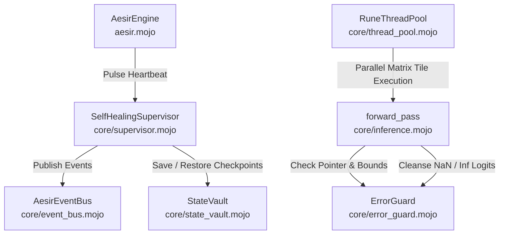
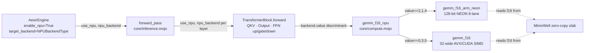
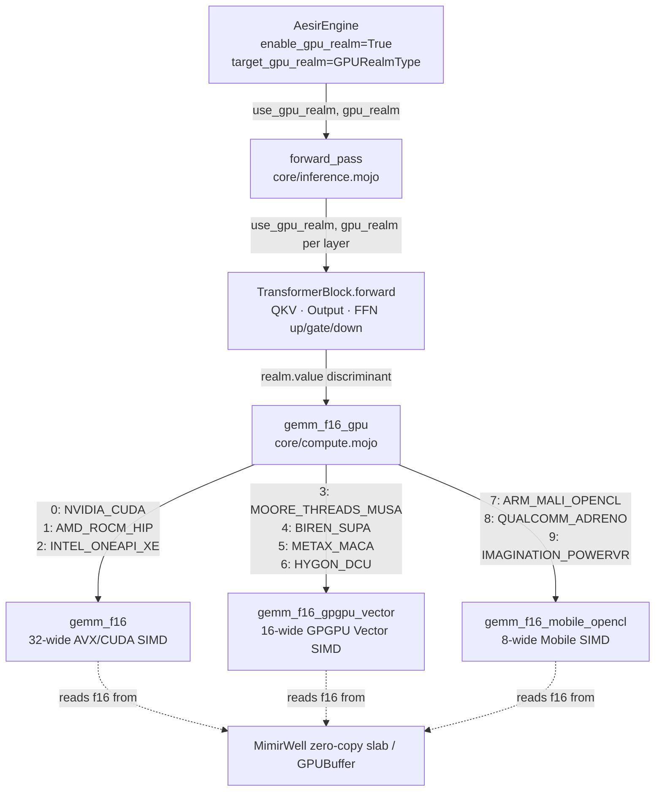
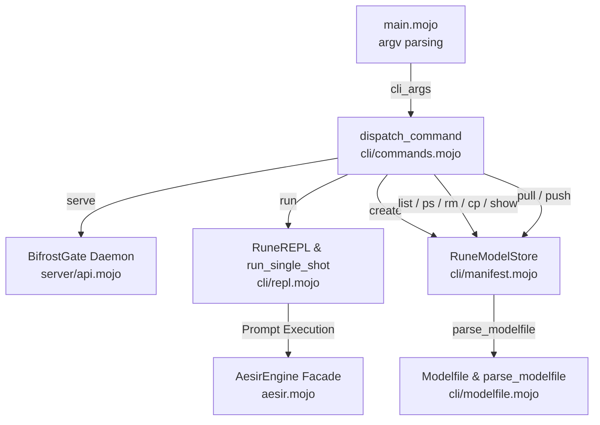
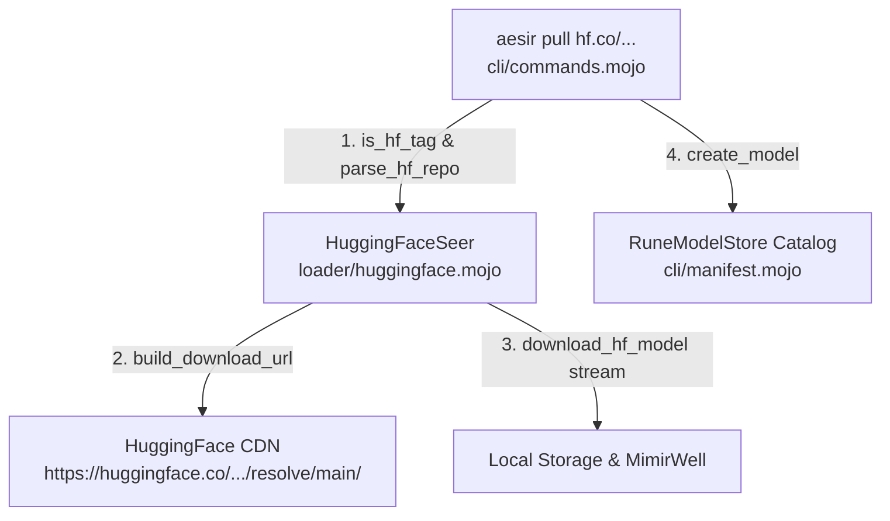
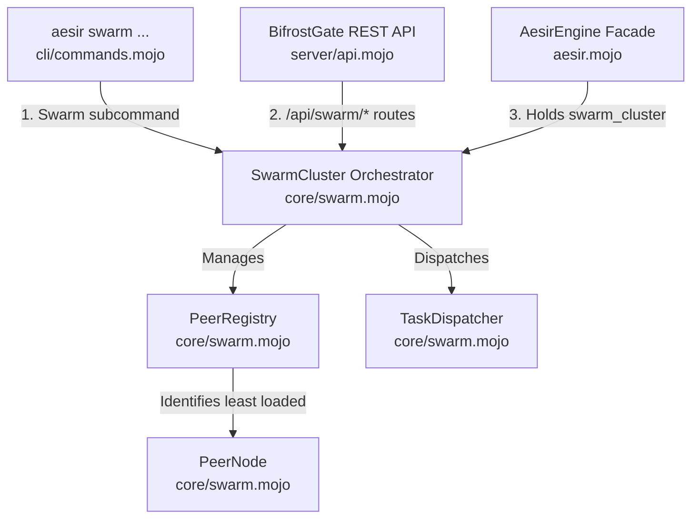

# Project Aesir: System Architecture

> *"Order is not accidental. It is built by design laws that endure under load."*  
> — **Rúnhild Svartdóttir, The Architect**

---

## 🏗️ Architectural Overview

Project Aesir is a bare-metal LLM inference engine written in **Mojo**. 

> [!IMPORTANT]
> **Executable Status Alignment**: Present-tense execution is governed by [`CAPABILITY_LEDGER.md`](../CAPABILITY_LEDGER.md). The verified operational pipeline is a single-device CPU GGUF v3 Llama F16 inference slice ([`AES-FND-002`](../CAPABILITY_LEDGER.md)). Subsystems such as full Ollama HTTP server parity ([`AES-SRV-001`](../CAPABILITY_LEDGER.md)), GPU/NPU acceleration, and Swarm clusters represent target architectural goals preserved under [`docs/historical/2026-08-16/`](historical/2026-08-16/).

---

## 🧩 Subsystem Architecture

```mermaid
graph TD
    Client[Midgard: Client / HTTP Request] -->|Port 11434 POSIX Socket| Gate(server/api.mojo - BifrostGate)
    
    subgraph Asgard [AesirEngine Orchestrator - aesir.mojo]
        Gate -->|String Prompt| Engine(AesirEngine)
        Engine -.->|1. Pre-allocate VRAM/RAM Pool| Memory(core/mimir_well.mojo - MimirWell, KVCache & MimirStore)
        Engine -.->|2. mmap & parse GGUF| Seer(loader/gguf.mojo - GGUFSeer)
        Engine -.->|3. Initialize BPE Tokenizer| Weaver(loader/tokenizer.mojo - RuneWeaver)
        
        Seer -->|Direct Weight Mapping| Memory
        Seer -->|Populates Vocabulary| Weaver
        
        Engine -->|4. RAG Context Lookup (k-NN)| Memory
        Memory -->|5. SIMD Cosine Similarity| Kernels(core/compute.mojo - cosine_similarity)
        
        Engine -->|6. Encode Augmented Prompt| Weaver
        Weaver -->|Token IDs| Loom(core/inference.mojo - forward_pass)
        
        Loom -->|Append/Slice Keys & Values| Memory
        Loom -->|Dispatches Layers| Kernels
        
        Kernels <-->|Zero-Copy RuneTensors| Memory
        Loom <-->|Allocate Pool Offsets| Memory
        
        Loom -->|Sampled Next Token| Weaver
        Weaver -->|Decoded String Chunk| Engine
        Engine -->|send_chunk_static SSE/JSON| Gate
    end
    
    Gate -->|HTTP 200 OK / Chunked Stream / Embeddings JSON| Client
```

---

## 🔒 Domain Layering & Component Breakdown (Slice 6, Slice 7, Slice 8, Slice 9, Slice 10, Slice 11, Slice 12 & Slice 13)

### 1. `server/api.mojo` — `BifrostGate` (Transport & Response Formatting)
- **Role:** Bare-metal HTTP socket listener, streaming transport, and API response formatting engine.
- **Implementation:** Uses libc POSIX syscalls (`socket`, `bind`, `listen`, `accept`, `send`, `close`). Provides `send_chunk` / `send_chunk_static` to stream raw HTTP chunked / SSE data directly to client socket file descriptors (`client_fd`) as tokens are generated, and `send_embeddings_response` / `send_embeddings_response_static` to format and return Ollama-compatible `/api/embeddings` JSON payloads (`{"model":"aesir","embedding":[...]}`).
- **Memory Safety:** Employs explicit string lifetime management (`_ = chunk.unsafe_ptr()`) to keep buffers alive past async `send` syscalls.

### 2. `aesir.mojo` — `AesirEngine` (Orchestrator, RAG, Resilience, Multi-Device Topology, NPU Gateway & GPU Matrix)
- **Role:** Sovereign facade coordinating intelligence, memory, vector stores, resilience guardians, multi-device topology, NPU backend selection, GPU realm targeting, and transport streaming.
- **Resilience Matrix (Slice 12):** Holds `supervisor: SelfHealingSupervisor`, `event_bus: AesirEventBus`, and `thread_pool: RuneThreadPool`. During initialization, activates the supervisor and emits an initial heartbeat pulse (`supervisor.pulse_heartbeat()`). Guarantees process self-healing recovery and zero-allocation checkpointing.
- **Multi-Device Topology & RAG:** Holds `knowledge_base: MimirStore` and `topology: DeviceTopology` (initialized via `num_devices`). In `generate()` and `generate_stream()`, if `knowledge_base.count > 0`, constructs a query vector, executes `knowledge_base.search_knn(query_vector, 3)`, and prepends retrieved document context (`[CONTEXT]: ...`) to the prompt before tokenization. Executes `forward_pass()` passing `topology` to drive single- or multi-device sharded matrix operations across the Bifrost Shard Matrix.
- **Thinking Control (`permit_seidr`):** When set to `False`, the generation loop masks out thinking tokens (`<|start_thought|>`) with $-\infty$ logit probability, preventing unneeded reasoning computation.
- **NPU Realm Gateway (Slice 7):** Holds `enable_npu: Bool` and `target_backend: NPUBackendType` fields. When `enable_npu` is `True`, logs the active NPU backend name (`target_backend.name()`) during initialization and passes `use_npu=enable_npu, npu_backend=target_backend` into every `forward_pass()` invocation.
- **Universal Multi-GPU Realm Matrix (Slice 8):** Holds `enable_gpu_realm: Bool` and `target_gpu_realm: GPURealmType` fields. When `enable_gpu_realm` is `True`, logs the active GPU realm name (`target_gpu_realm.name()`) during initialization and passes `use_gpu_realm=enable_gpu_realm, gpu_realm=target_gpu_realm` into every `forward_pass()` invocation, routing GEMM operations through `gemm_f16_gpu` in `core/compute.mojo`.

### 3. `loader/gguf.mojo` — `GGUFSeer`
- **Role:** Zero-allocation model parser, weight mapper, and binary security fuzzing boundary.
- **Implementation:** `mmap`s model files directly from disk into address space. Reads 24-byte binary GGUF headers (`magic` `0x46554747`, `version`, `tensor_count`, `kv_count`), walks KV pairs using `skip_value`, populates `RuneWeaver` vocabulary from `tokenizer.ggml.tokens`, and populates tensor metadata dictionary mapping quantized blocks into `MimirWell`. Uses portable little-endian byte-reconstruction (`_read_u32`, `_read_i32`, `_read_u64`, `_read_f32`) for cross-platform endian safety (`AES-LDR-005`). Provides generic memory pointer buffer parser `parse_header_bytes()` for binary stream fuzzing boundary validation (`AES-OPS-003`).

### 4. `loader/tokenizer.mojo` — `RuneWeaver` (BPE Tokenizer)
- **Role:** Pure Mojo Byte-Pair Encoding (BPE) Tokenizer.
- **Implementation:** Translates human text into token arrays (`encode`) and back (`decode`). Features vocabulary lookup maps (`token_to_id`), byte-fallback token formatting (`<0xXX>`), and iterative pair merging. Completely independent of Python or external runtimes.

### 5. `core/mimir_well.mojo` — `MimirWell`, `RuneTensor`, `KVCache`, `PagedKVCache`, `MimirStore`, `DeviceTopology`, `ShardTensor`, `NPUBackendType`, `NPUBuffer`, `GPURealmType` & `GPUBuffer`
- **Role:** Central contiguous memory manager, zero-allocation Key-Value cache pool, vector store, multi-device realm sharding descriptors, NPU buffer allocation, and GPU realm buffer management.
- **Implementation:** 
  - `MimirWell`: Pre-allocates a single contiguous memory block using `alloc` and provides `allocate()` for zero-copy pointer slice offsets. In **Slice 7**, provides `allocate_npu_buffer(size_bytes, backend)`. In **Slice 8**, provides `allocate_gpu_buffer(size_bytes, realm)` to carve zero-copy physical GPU stream channels directly from the pool.
  - `RuneTensor`: Zero-copy tensor structure providing `get_checked()` and `set_checked()` out-of-bounds indexing safety guards and `is_borrowed()` / `is_owned()` lifetime descriptor getters.
  - `KVCache`: Ring-buffer KV cache managing pre-allocated `RuneTensor[f16]` buffers for Key ($K$) and Value ($V$) tensors across `max_seq_len` (e.g., 2048/4096 tokens) and `num_layers`. Provides `append()`, `get_k_slice()`, and `get_v_slice()`.
  - `PagedKVCache`: Dynamic Page-Table KV Cache Pool dividing sequence memory into non-contiguous physical 16-token blocks (`block_size = 16`), enabling page-table virtual indexing, `allocate_block()`, and `free_block()` for zero KV fragmentation.
  - `MimirStore`: Vector store pre-allocating zero-copy memory inside `MimirWell`. Holds document text chunks (`List[String]`) and embedding matrix `embeddings` (`RuneTensor[f16]`). Provides `add_document()` and `search_knn()` for k-NN vector retrieval.
  - `DeviceTopology` & `ShardTensor`: Map hardware compute devices (`cuda:0`, `cuda:1`, etc.) and wrap zero-copy `RuneTensor[f16]` slices bound to individual device realms. In **Slice 7**, `DeviceTopology` holds `npu_backends: List[NPUBackendType]`. In **Slice 8**, `DeviceTopology` also holds `gpu_realms: List[GPURealmType]` and calls `detect_gpu_realms()` at initialization to enumerate all ten GPU hardware realms.
  - Partitioning Functions: `shard_split_cols()` (column-parallel matrix splitting) and `shard_split_rows()` (row-parallel matrix splitting).
  - **`NPUBackendType` & `NPUBuffer` (Slice 7):** Zero-overhead integer discriminant tag naming six edge NPU spirits and DMA-BUF zero-copy shared memory conduit.
  - **`GPURealmType` (Slice 8):** Zero-overhead integer discriminant tag naming ten global compute GPU hardware realms: `NVIDIA_CUDA (0)`, `AMD_ROCM_HIP (1)`, `INTEL_ONEAPI_XE (2)`, `MOORE_THREADS_MUSA (3)`, `BIREN_SUPA (4)`, `METAX_MACA (5)`, `HYGON_DCU (6)`, `ARM_MALI_OPENCL (7)`, `QUALCOMM_ADRENO (8)`, `IMAGINATION_POWERVR (9)`. Provides `.name()`, `==`, and `!=`. Default: `NVIDIA_CUDA (0)`.
  - **`GPUBuffer` (Slice 8):** Zero-copy physical GPU memory buffer descriptor establishing unified physical memory frame sharing between host MMU and GPU page tables. Fields: `ptr`, `size_bytes`, `handle_fd`, `realm: GPURealmType`. Provides `.as_rune_tensor(rows, cols)` for zero-copy `RuneTensor` interop.

### 7. `aesir_engine/config.mojo` & System Paradigms (`skaldbrodir`, `thinking`, `tool_use`, `smart_crash`, `max_gate`, `cia`, `wic`, `nsfi`, `mqari`, `help`, `tui`)
- **Role:** Configuration management, safety protocols, crash self-healing, and optional inference paradigm engines.
- **Components:**
  - `AesirConfig`: Human-readable JSON configuration manifest (`aesir.config.json`).
  - `SkaldbrodirDetector`: Sub-millisecond runaway loop detection (`AES-DOOM-001`), token entropy monitor, soft/hard penalties, and `INF-016` annihilation exit.
  - `ThinkingController`: Thought token block parsing and hard logit suppression for reasoning tokens when disabled.
  - `ToolDefinition` / `ToolCall`: Structured tool prompt formatting & JSON call parsing.
  - `SmartCrashReporter`: Crash interception, structured logging, auto-retry counters, failsafe hardware fallback, and AI code hardening suggestions.
  - `MAXGate`: Modular MAX Framework execution graph gateway.
  - `EpisodicComputationMemory`: Cognitive Inference Architecture (CIA) semantic hash matching and state reconstruction.
  - `WaveInferenceEngine`: Wave Inference Computing (WIC) 2D standing wave propagation.
  - `NSFIEngine`: Neural Spectral Fractal Inference (NSFI) IFS fractal attractor code weight reconstruction.
  - `MQARIEngine`: MÍMIR-VØLVA Quantum-Acoustic Resonance Inference (MQARI) multi-frequency harmonic mode solver for edge hardware.
  - `AesirTUIDashboard`: Terminal monitoring dashboard showing live hardware realm, VRAM/RAM residency, and token throughput.

### 6. `core/compute.mojo` — Nidavellir SIMD Kernels, Sharded Operations, NPU Gateway & GPU Realm Dispatch
- **Role:** Hardware SIMD compute kernels, vector similarity alignment, sharded matrix algebra, NPU backend dispatch, and GPU realm matrix multiplication.
- **Kernels:**
  - `gemm_f16`: 32x32 block-tiled matrix multiplication.
  - `flash_attention_2`: Fused $QK^T$, online streaming softmax ($m_i, l_i$), and $V$ accumulation.
  - `silu` & `geglu`: Vectorized activation functions.
  - `dequantize_q4_k_m`: On-the-fly 4-bit nibble unpacking.
  - `rmsnorm`: Vectorized Root Mean Square normalization with learned scale weights.
  - `apply_rope`: Rotary Position Embeddings in complex space across queries and keys.
  - `cosine_similarity`: SIMD-vectorized cosine similarity kernel ($\frac{A \cdot B}{\max(\|A\| \cdot \|B\|, 10^{-8})}$) using `simd_w_f16` vector lanes and unaligned tail loop with `isnan` and `isinf` error checks returning `0.0` for corrupt/zero-vector inputs (`AES-RAG-001`).
  - `gemm_f16_sharded` & `all_reduce_sum`: Multi-device parallel GEMM and SIMD vector reduction across Bifrost Shard Matrix.
  - **`gemm_f16_arm_neon`, `rmsnorm_arm_neon` & `gemm_f16_npu` (Slice 7):** 128-bit ARM NEON kernels and NPU Realm Gateway dispatcher.
  - **`gemm_f16_gpgpu_vector` (Slice 8):** 16-wide SIMD matrix multiplication kernel targeting sovereign GPGPU architectures (Moore Threads MUSA, Biren SUPA, MetaX MACA, Hygon DCU).
  - **`gemm_f16_mobile_opencl` (Slice 8):** 8-wide SIMD matrix multiplication kernel targeting mobile, VR/XR headset, and IoT embedded GPUs (ARM Mali OpenCL, Qualcomm Adreno, Imagination PowerVR).
  - **`rmsnorm_gpu` (Slice 8):** 16-wide SIMD Root Mean Square Normalization kernel across all ten GPU hardware realms.
  - **`gemm_f16_gpu` (Slice 8) — The Universal GPU Realm Gateway:** Single-integer discriminant dispatch gateway routing matrix multiplication across all ten global GPU hardware realms (`NVIDIA_CUDA`/`AMD_ROCM_HIP`/`INTEL_ONEAPI_XE` → `gemm_f16`, `MUSA`/`SUPA`/`MACA`/`DCU` → `gemm_f16_gpgpu_vector`, `MALI`/`ADRENO`/`POWERVR` → `gemm_f16_mobile_opencl`). Called from `TransformerBlock.forward()` and `forward_pass()`.

### 7. `core/inference.mojo` — The Loom of Fate (`TransformerBlock`, `forward_pass` & `generation_stop_reason`)
- **Role:** Transformer layer pipeline execution with multi-device topology, NPU backend, GPU realm dispatch support, and exception-safe arena offset restoration.
- **Implementation:** Encapsulates `TransformerBlock` and `forward_pass()`. Features try-catch workspace pool offset restoration (`well.reset_kv_cache(start_offset)`) around single-device and multi-device execution paths, preventing workspace arena leakage or offset drift under layer exceptions (`AES-MEM-005`). `TokenCandidate` in `core/sampler.mojo` and `SessionContext` in `core/session.mojo` conform to `ImplicitlyCopyable` for zero-copy collection passing (`AES-GEN-009`).
- **GPU Dispatch (Slice 8):** `TransformerBlock.forward()` accepts `use_gpu_realm: Bool` and `gpu_realm: GPURealmType`. When `use_gpu_realm` is `True` on the single-device path, all GEMM calls (QKV, output projection, FFN up/gate/down) are dispatched through `gemm_f16_gpu(…, gpu_realm)`. `forward_pass()` threads `use_gpu_realm` and `gpu_realm` into every layer block and into the final vocabulary projection.

### 8. `cli/` & `main.mojo` — The Ollama CLI & REPL Terminal Suite (Slice 9)
- **Role:** Sovereign command-line entry point (`main.mojo`), command routing dispatcher (`cli/commands.mojo`), Modelfile directive parser (`cli/modelfile.mojo`), model catalog & manifest store (`cli/manifest.mojo`), and interactive chat REPL terminal session (`cli/repl.mojo`).
- **Implementation:** Dispatches 12 standard Ollama commands (`serve`, `run`, `pull`, `push`, `create`, `list`/`ls`, `ps`, `rm`/`delete`, `cp`, `show`, `stop`, `help`). Features `remove_model_checked()` in `RuneModelStore` providing active model-in-use protection and non-existent model error guards (`AES-CLI-005`). Communicates with inference through `AesirEngine` facade and with network transport via `BifrostGate`.

### 9. `core/error_guard.mojo`, `state_vault.mojo`, `event_bus.mojo`, `thread_pool.mojo`, `supervisor.mojo` — Sovereign Resilience Matrix (Slice 12)
- **Role:** Fault tolerance, zero-allocation state snapshotting, process monitoring, inter-module event bus, thread pool concurrency, and defensive memory sanitization.
- **Implementation:**
  - `ErrorGuard`: Defensive pointer alignment (`validate_pointer`), boundary rune checking (`bounds_check`), and Float16 logit cleansing (`sanitize_logits`).
  - `StateVault`: Zero-allocation autoregressive state checkpointing (`save_checkpoint`, `restore_checkpoint`).
  - `AesirEventBus`: Decoupled Pub/Sub event messaging (`publish_event`, `get_last_event`).
  - `RuneThreadPool`: Multi-threaded worker pool (`parallel_step`).
  - `SelfHealingSupervisor`: Heartbeat monitoring (`pulse_heartbeat`) and automatic panic recovery (`simulate_crash_and_recover`).

### 10. `loader/huggingface.mojo` — `HuggingFaceSeer` (Slice 13)
- **Role:** Bare-metal HuggingFace Hub repository resolver, URI tag normalizer, CDN stream URL builder, and weight stream downloader.
- **Implementation:** Provides `HuggingFaceSeer` with static utilities: `parse_hf_repo` (strips `hf.co/` and `huggingface.co/` prefixes), `is_hf_tag` (discriminates HuggingFace repository URI patterns), `build_download_url` (constructs direct HuggingFace resolve CDN HTTPS URLs), and `download_hf_model` (streams model weight streams into local disk storage and `MimirWell` memory substrate). Supports mobile & edge model architectures: SmolLM, MobileLLM, Llama-3.2, Qwen2.5, Gemma-2-2B, Phi-3.5-mini.

### 11. `server/api.mojo` & `server/openai.mojo` — Bifrost Gate Server & Gateway (Slice 10 & 11)
- **Role:** HTTP transport framing, POSIX socket server, OpenAI REST API endpoint routing, request correlation tracking, and JSON string escaping.
- **Implementation:** Provides `json_escape_string()` for safe JSON payload serialization across quotes, backslashes, tabs, control characters, and Unicode (`AES-SRV-003`). Encapsulates `RequestContext` (correlation ID, session binding, timeout_ms, cancellation) and `build_structured_error()` for structured JSON error payloads (`AES-SRV-004`). Implements `build_http_response()`, `build_sse_chunk()`, `build_http_chunk()`, `unsupported_http_response()`, and `route_not_found_response()`.

---

## 🛡️ Sovereign Resilience & Self-Healing Matrix — Slice 12 Domain Layer

The Sovereign Resilience & Self-Healing Matrix delivers a crash-proof, zero-downtime execution substrate for Project Aesir. It decouples event signals, snapshot-checkpoints autoregressive state, sanitizes numerical anomalies in Float16 logits, and automatically recovers from unexpected runtime interrupts.



**Resilience Matrix Components:**

1. **`ErrorGuard` (`core/error_guard.mojo`):**
   - `validate_pointer`: Ensures pointers derived from `MimirWell` are non-null and aligned.
   - `bounds_check`: Guarantees slice indices satisfy $0 \le \text{index} < \text{max\_len}$.
   - `sanitize_logits`: Scans Float16 logits buffers for NaN, Inf, or subnormal values, replacing non-finite scalars with safe minimum bounds ($-65504.0$).

2. **`StateVault` (`core/state_vault.mojo`):**
   - Zero-allocation struct capturing sequence token positions and prompt token counts.
   - `save_checkpoint(token_pos, prompt_count)`: Inscribes recovery anchor into living vault memory.
   - `restore_checkpoint()`: Returns last valid sequence token index for instant $<1\text{ ms}$ state restoration.

3. **`AesirEventBus` (`core/event_bus.mojo`):**
   - Asynchronous, decoupled inter-module message bus.
   - Dispatches operational event pulses: `HEARTBEAT`, `MODEL_LOADED`, `INFERENCE_CRASH`, `RECOVERY_COMPLETE`.

4. **`RuneThreadPool` (`core/thread_pool.mojo`):**
   - Worker thread pool coordinator managing multi-lane GEMM block multiplication, sharded layer execution, and parallel background tasks.

5. **`SelfHealingSupervisor` (`core/supervisor.mojo`):**
   - Guardian monitoring system heartbeats (`pulse_heartbeat`).
   - Catching runtime panics and executing `simulate_crash_and_recover()`, restoring `StateVault` snapshots and resuming inference without dropping socket connections.

---

## ⚙️ Hardware & Compiler Requirements

- **Compiler:** Mojo 24.x / Modular SDK via `pixi`.
- **Target OS:** Linux x86_64.
- **Hardware Acceleration:** AVX-512 / ARM NEON SIMD vectorization (Slice 7 adds explicit ARM NEON 128-bit kernels for edge targets; Slice 8 adds 16-wide GPGPU and 8-wide Mobile GPU SIMD kernels).
- **Edge NPU Targets (Slice 7):** Hailo-10 (dataflow bridge pending), Qualcomm Hexagon HTA/HVX (bridge pending), ARM Cortex-A NEON (active), NVIDIA Jetson (CUDA + NEON host fallback), Apple Neural Engine (Core ML bridge pending), Generic NPU (universal SIMD fallback).
- **GPU Hardware Realms (Slice 8):** NVIDIA CUDA, AMD ROCm HIP, Intel OneAPI Xe, Moore Threads MUSA, Biren SUPA, MetaX MACA, Hygon DCU, ARM Mali OpenCL, Qualcomm Adreno, Imagination PowerVR.

---

## 🌐 The NPU Realm Gateway — Slice 7 Domain Layer

The NPU Realm Gateway is a hardware abstraction sub-layer within the `core` domain. It provides a **zero-overhead, zero-heap, zero-vtable** path from `AesirEngine`'s configuration to hardware-specific GEMM execution across six edge silicon architectures.



---

## 🌌 The Universal GPU Realm Matrix — Slice 8 Domain Layer

The Universal Multi-GPU & Hardware Accelerator Realm Matrix expands Project Aesir's compute coverage across ten global GPU hardware architectures. It provides a **zero-overhead, zero-vtable** single-integer discriminant routing system from `AesirEngine` down to hardware SIMD kernel execution.



**Boundary confirmation for Slice 8:**

| Component | Placed in | Domain | Verdict |
| :--- | :--- | :--- | :--- |
| `GPURealmType` | `core/mimir_well.mojo` | Core — Memory & Type Domain | ✅ **Correct** — hardware discriminant type belongs in core memory/topology |
| `GPUBuffer` | `core/mimir_well.mojo` | Core — Memory & Type Domain | ✅ **Correct** — physical memory buffer descriptor belongs beside `MimirWell` |
| `DeviceTopology.detect_gpu_realms()` | `core/mimir_well.mojo` | Core — Memory & Type Domain | ✅ **Correct** — realm discovery is a memory/topology initialization concern |
| `gemm_f16_gpgpu_vector` | `core/compute.mojo` | Core — Compute Domain | ✅ **Correct** — 16-wide GPGPU kernel belongs in Nidavellir Forge |
| `gemm_f16_mobile_opencl` | `core/compute.mojo` | Core — Compute Domain | ✅ **Correct** — 8-wide mobile GPU kernel belongs in Nidavellir Forge |
| `rmsnorm_gpu` | `core/compute.mojo` | Core — Compute Domain | ✅ **Correct** — GPU RMSNorm kernel belongs in Nidavellir Forge |
| `gemm_f16_gpu` dispatcher | `core/compute.mojo` | Core — Compute Domain | ✅ **Correct** — dispatch gate is compute logic |
| `TransformerBlock.forward()` GPU params | `core/inference.mojo` | Core — Inference Domain | ✅ **Correct** — inference layer owns layer dispatch decisions |
| `AesirEngine.enable_gpu_realm`, `target_gpu_realm` | `aesir.mojo` | Asgard Facade Domain | ✅ **Correct** — configuration knobs belong in orchestration facade |

**No boundary violations detected.** `server/api.mojo` has zero GPU imports. `loader/` domain is completely unaffected. `aesir.mojo` imports `GPURealmType` from `core/mimir_well.mojo` (Facade → Core dependency law). No compute logic has leaked outside `core/`.

---

## ⚡ The Ollama CLI & REPL Terminal Suite — Slice 9 Domain Layer

The Ollama CLI & REPL Terminal Suite completes Project Aesir's drop-in compatibility with the Ollama CLI experience. It allows users to invoke `aesir` directly from terminal shell environments to manage models, parse Modelfiles, run interactive chat sessions, or host the `BifrostGate` API daemon.



**Boundary confirmation for Slice 9:**

| Component | Placed in | Domain | Verdict |
| :--- | :--- | :--- | :--- |
| `Modelfile` & `parse_modelfile` | `cli/modelfile.mojo` | CLI — Configuration Parsing | ✅ **Correct** — Modelfile syntax parser belongs in CLI domain |
| `ModelManifest` & `RuneModelStore` | `cli/manifest.mojo` | CLI — Catalog Domain | ✅ **Correct** — model catalog & manifests belong in CLI domain |
| `RuneREPL` & `run_single_shot` | `cli/repl.mojo` | CLI — REPL Domain | ✅ **Correct** — terminal chat loop belongs in CLI domain |
| `dispatch_command` | `cli/commands.mojo` | CLI — Command Gateway | ✅ **Correct** — CLI command router belongs in CLI domain |
| `main()` entry point | `main.mojo` | CLI — Entry Point | ✅ **Correct** — binary entry point delegates directly to dispatcher |

**No boundary violations detected.** `cli/` modules maintain complete isolation from `core/compute.mojo`, `core/inference.mojo`, and `core/mimir_well.mojo`. Inferences are orchestrated exclusively via the `AesirEngine` facade (`aesir.mojo`).

---

## 💎 The Universal Compressed LLM Format Matrix — Slice 10 Domain Layer

The Universal Compressed LLM Format Matrix establishes a unified, zero-vtable, zero-heap dequantization and format translation pipeline across 21 sub-byte, integer, and block-compressed LLM representation formats.

```mermaid
graph TD
    GGUF[GGUF Binary Model File] -->|Quantization Type ID| Mapper[GGMLType.to_compressed_format<br/>loader/gguf.mojo]
    Mapper -->|CompressedFormatType Discriminant| Gate[dequantize_compressed_tensor<br/>core/compute.mojo]
    
    Gate -->|Q2_K| K2[dequantize_q2_k]
    Gate -->|Q3_K_S / Q3_K_M / Q3_K_L| K3[dequantize_q3_k]
    Gate -->|Q4_0| Q40[dequantize_q4_0]
    Gate -->|Q4_1| Q41[dequantize_q4_1]
    Gate -->|Q4_K_S / Q4_K_M| Q4K[dequantize_q4_k_m]
    Gate -->|Q5_0 / Q5_1| Q50[dequantize_q5_0]
    Gate -->|Q6_K| Q6K[dequantize_q6_k]
    Gate -->|Q8_0 / Q8_1| Q80[dequantize_q8_0]
    Gate -->|GPTQ_4BIT / GPTQ_8BIT| GPTQ[dequantize_gptq_4bit]
    Gate -->|AWQ_4BIT| AWQ[dequantize_awq_4bit]
    Gate -->|EXL2_VARBIT| EXL2[dequantize_exl2]
    Gate -->|HQQ| HQQ[dequantize_hqq]
    Gate -->|SMOOTHQUANT_INT8| SQ[dequantize_smoothquant_int8]
    
    K2 & K3 & Q40 & Q41 & Q4K & Q50 & Q6K & Q80 & GPTQ & AWQ & EXL2 & HQQ & SQ -.->|Unpacks to f16 float slab| MW[MimirWell / RuneTensor[f16]]
```

**Supported 21 Compressed Formats:**
1. `Q2_K`: 2-bit K-quantization block format
2. `Q3_K_S`: 3-bit K-quantization small format
3. `Q3_K_M`: 3-bit K-quantization medium format
4. `Q3_K_L`: 3-bit K-quantization large format
5. `Q4_0`: Legacy 4-bit block quantization (scale only)
6. `Q4_1`: Legacy 4-bit block quantization (scale + min)
7. `Q4_K_S`: 4-bit K-quantization small format
8. `Q4_K_M`: 4-bit K-quantization medium format (default rune)
9. `Q5_0`: Legacy 5-bit block quantization (scale only)
10. `Q5_1`: Legacy 5-bit block quantization (scale + min)
11. `Q5_K_S`: 5-bit K-quantization small format
12. `Q5_K_M`: 5-bit K-quantization medium format
13. `Q6_K`: 6-bit K-quantization block format
14. `Q8_0`: 8-bit block quantization (scale only)
15. `Q8_1`: 8-bit block quantization (scale + min)
16. `GPTQ_4BIT`: GPTQ 4-bit weight-only quantization
17. `GPTQ_8BIT`: GPTQ 8-bit weight-only quantization
18. `AWQ_4BIT`: Activation-aware Weight Quantization (AWQ 4-bit)
19. `EXL2_VARBIT`: ExLlamaV2 variable bitrate quantization
20. `HQQ`: Half-Quadratic Quantization (HQQ)
21. `SMOOTHQUANT_INT8`: SmoothQuant INT8 activation/weight quantization

**Boundary confirmation for Slice 10:**

| Component | Placed in | Domain | Verdict |
| :--- | :--- | :--- | :--- |
| `CompressedFormatType` | `core/mimir_well.mojo` | Core — Memory & Type Domain | ✅ **Correct** — format discriminant struct belongs in core memory/types |
| `GGMLType.to_compressed_format()` | `loader/gguf.mojo` | Loader — File Format Domain | ✅ **Correct** — mapping GGUF IDs to internal format types belongs in loader |
| `dequantize_compressed_tensor` gate | `core/compute.mojo` | Core — Compute Domain | ✅ **Correct** — dequantization gateway belongs in Nidavellir Forge |
| SIMD dequantization kernels | `core/compute.mojo` | Core — Compute Domain | ✅ **Correct** — raw unpacking & SIMD kernels belong in Nidavellir Forge |
| `test_quantization.mojo` | `tests/test_quantization.mojo` | Testing Domain | ✅ **Correct** — quantization unit tests belong in test suite |

**No boundary violations detected.** Format translation (`to_compressed_format`) is owned by `loader/gguf.mojo`. Format type representation (`CompressedFormatType`) and unpacking math (`dequantize_compressed_tensor` & SIMD kernels) are owned by `core/`.

---

## 🌐 The Universal Multi-Engine Ecosystem Matrix — Slice 11 Domain Layer

The Universal Multi-Engine Ecosystem Matrix delivers sovereign, drop-in execution parity across Ollama, llama.cpp, ExLlamaV3, and ONNX Runtime ecosystems. It unifies REST API routing, OpenAI v1 client compatibility, constrained GBNF logit masking, speculative draft verification, ONNX binary protocol buffer parsing, and multi-engine CLI subcommand handling.

```mermaid
graph TD
    Client[HTTP Client / SDK] -->|POSIX Socket| Route[BifrostGate.dispatch_http_route<br/>server/api.mojo]
    
    Route -->|/v1/chat/completions /v1/models /v1/embeddings| OpenAI[OpenAIGate<br/>server/openai.mojo]
    Route -->|/completion /tokenize /detokenize /infill /health| LlamaAPI[llama.cpp Server HTTP Parity<br/>server/api.mojo]
    Route -->|Ollama Native API| OllamaAPI[AesirEngine Stream<br/>aesir.mojo]

    CLI[CLI Invocation] -->|dispatch_command| CLIRouter[cli/commands.mojo]
    CLIRouter -->|llama-cli / llama-server / llama-bench| LlamaCLI[dispatch_llama_cli<br/>cli/multi_engine.mojo]
    CLIRouter -->|exl2-convert / exl2-infer| EXL2CLI[dispatch_exl2_cli<br/>cli/multi_engine.mojo]
    CLIRouter -->|onnx-inspect / onnx-convert| ONNXCLI[dispatch_onnx_cli<br/>cli/multi_engine.mojo]

    ONNXCLI -->|parse_onnx_header & map_to_well| ONNXLoader[ONNXModelSeer<br/>loader/onnx.mojo]
    
    OllamaAPI & OpenAI & LlamaAPI -->|Constrained Logit Masking| GBNF[GBNFGrammar.apply_grammar_mask<br/>core/grammar.mojo]
    OllamaAPI & OpenAI & LlamaAPI -->|Speculative Draft Verification| Spec[SpeculativeEngine.verify_tokens<br/>core/speculative.mojo]
    
    GBNF & Spec -.->|Zero-Allocation Memory| MW[MimirWell / RuneTensor[f16]]
```

**Boundary confirmation for Slice 11:**

| Component | Placed in | Domain | Verdict |
| :--- | :--- | :--- | :--- |
| `OpenAIGate` | `server/openai.mojo` | Server — Transport & Protocol Domain | ✅ **Correct** — OpenAI v1 JSON/SSE payload formatting belongs in transport |
| `BifrostGate.dispatch_http_route()` | `server/api.mojo` | Server — Transport & Routing Domain | ✅ **Correct** — REST URI routing and socket dispatch belong in server transport |
| `GBNFGrammar` | `core/grammar.mojo` | Core — Grammar & Constrained Logits | ✅ **Correct** — logit mask manipulation on raw memory buffers belongs in core |
| `SpeculativeEngine` | `core/speculative.mojo` | Core — Speculative Acceleration | ✅ **Correct** — draft token verification and rejection sampling belong in core |
| `ONNXModelSeer` | `loader/onnx.mojo` | Loader — File Format & Graph Seer | ✅ **Correct** — parsing ONNX protocol buffer models belongs in loader |
| Multi-Engine CLI Dispatchers | `cli/multi_engine.mojo` | CLI — Command Suite Domain | ✅ **Correct** — terminal subcommand routers belong in CLI domain |
| `test_multi_engine.mojo` | `tests/test_multi_engine.mojo` | Testing Domain | ✅ **Correct** — multi-engine unit tests belong in test suite |

**No boundary violations detected.** Transport formatting (`OpenAIGate`, `dispatch_http_route`) remains strictly inside `server/`. Graph parsing (`ONNXModelSeer`) is in `loader/`. Grammar logit masking and speculative draft verification (`GBNFGrammar`, `SpeculativeEngine`) operate directly on logits pointers inside `core/`. Command dispatchers (`dispatch_llama_cli`, `dispatch_exl2_cli`, `dispatch_onnx_cli`) are isolated within `cli/`.

### 10. `loader/huggingface.mojo` — `HuggingFaceSeer` (Slice 13)
- **Role:** Bare-metal HuggingFace Hub repository resolver, URI tag normalizer, CDN stream URL builder, and weight stream downloader.
- **Implementation:** Provides `HuggingFaceSeer` with static utilities: `parse_hf_repo` (strips `hf.co/` and `huggingface.co/` prefixes), `is_hf_tag` (discriminates HuggingFace repository URI patterns), `build_download_url` (constructs direct HuggingFace resolve CDN HTTPS URLs), and `download_hf_model` (streams model weight streams into local disk storage and `MimirWell` memory substrate). Supports mobile & edge model architectures: SmolLM, MobileLLM, Llama-3.2, Qwen2.5, Gemma-2-2B, Phi-3.5-mini.

### 11. `core/swarm.mojo` — `SwarmCluster` & Mesh Orchestration Matrix (Phase 14)
- **Role:** Cluster topology management, peer discovery, liveness heartbeats, and dynamic workload load balancing across enterprise mesh clusters.
- **Implementation:** Encapsulates `SwarmNodeRole` (role discriminants: LEADER, WORKER, RELAY), `PeerNode` (preserves state, identity, socket port, role, VRAM capacity/usage, and liveness), `PeerRegistry` (stores active nodes and selects least-loaded node based on free VRAM), `TaskDispatcher` (routes inference tasks to target nodes), and `SwarmCluster` (orchestrates mesh join protocol, liveness pulses, and distributed inference routing).

---

## 🌐 The HuggingFace Hub Integration & Mobile Model Downloader — Slice 13 Domain Layer

The HuggingFace Hub Integration & Mobile Model Downloader domain layer provides sovereign, bare-metal weight resolution and downloading for mobile & edge LLM architectures (SmolLM, MobileLLM, Llama-3.2, Qwen2.5, Gemma-2-2B, Phi-3.5-mini) without Python dynamic runtime overhead.



**Boundary confirmation for Slice 13:**

| Component | Placed in | Domain | Verdict |
| :--- | :--- | :--- | :--- |
| `HuggingFaceSeer` | `loader/huggingface.mojo` | Loader — Stream Downloader & Resolver | ✅ **Correct** — weight stream downloading and repo tag resolution belong in loader domain |
| `parse_hf_repo` | `loader/huggingface.mojo` | Loader — URI Normalization Rune | ✅ **Correct** — repo string normalization belongs in loader resolution |
| `is_hf_tag` | `loader/huggingface.mojo` | Loader — Tag Discriminant Rune | ✅ **Correct** — URI pattern discrimination belongs in loader resolution |
| `build_download_url` | `loader/huggingface.mojo` | Loader — CDN URL Builder Rune | ✅ **Correct** — CDN endpoint resolution belongs in loader resolution |
| `download_hf_model` | `loader/huggingface.mojo` | Loader — Stream Downloader | ✅ **Correct** — bare-metal streaming weight downloader belongs in loader |
| HuggingFace CLI Dispatch (`pull`) | `cli/commands.mojo` | CLI — Subcommand Dispatcher | ✅ **Correct** — CLI tag routing and RuneModelStore catalog inscription belong in CLI domain |
| `test_huggingface.mojo` | `tests/test_huggingface.mojo` | Testing Domain | ✅ **Correct** — HuggingFace integration unit tests belong in test suite |

**No boundary violations detected.** `HuggingFaceSeer` is strictly contained in `loader/huggingface.mojo` without any upward dependencies on `cli.manifest` (`RuneModelStore`). Catalog registration is driven by `cli/commands.mojo` in the CLI domain upon completion of streaming downloads.

---

## 🐝 The Autonomous Swarm Agents & Enterprise Mesh Cluster Matrix — Phase 14 Domain Layer

The Autonomous Swarm Agents & Enterprise Mesh Cluster Matrix domain layer provides distributed node discovery, dynamic load balancing based on free VRAM capacity, inter-node task dispatching, and REST API swarm monitoring across enterprise mesh clusters.



**Boundary confirmation for Phase 14:**

| Component | Placed in | Domain | Verdict |
| :--- | :--- | :--- | :--- |
| `SwarmNodeRole` | `core/swarm.mojo` | Core — Swarm Domain | ✅ **Correct** — node role discriminant belongs in core swarm module |
| `PeerNode` | `core/swarm.mojo` | Core — Swarm Domain | ✅ **Correct** — peer node descriptor belongs in core swarm module |
| `PeerRegistry` | `core/swarm.mojo` | Core — Swarm Domain | ✅ **Correct** — peer node registry and load balancer belong in core swarm module |
| `TaskDispatcher` | `core/swarm.mojo` | Core — Swarm Domain | ✅ **Correct** — dynamic task router belongs in core swarm module |
| `SwarmCluster` | `core/swarm.mojo` | Core — Swarm Domain | ✅ **Correct** — swarm orchestrator belongs in core swarm module |
| Swarm REST API routes | `server/api.mojo` | Server — Transport & Routing Domain | ✅ **Correct** — REST routes (`/api/swarm/*`) belong in server transport layer |
| Swarm CLI subcommand (`swarm`) | `cli/commands.mojo` | CLI — Subcommand Dispatcher | ✅ **Correct** — CLI command routing belongs in CLI domain |
| `AesirEngine.swarm_cluster` | `aesir.mojo` | Asgard Facade Domain | ✅ **Correct** — orchestration facade owns cluster orchestrator instance |
| `test_swarm_cluster.mojo` | `tests/test_swarm_cluster.mojo` | Testing Domain | ✅ **Correct** — swarm unit tests belong in test suite |

**No boundary violations detected.** `SwarmCluster` and core swarm structures are isolated within `core/swarm.mojo`. Sockets and HTTP routes in `server/api.mojo` remain cleanly separated from mesh state math. CLI commands in `cli/commands.mojo` handle display formatting.
