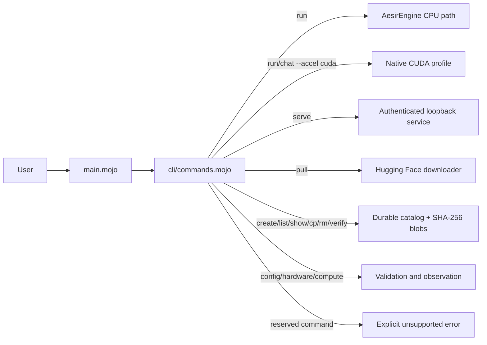
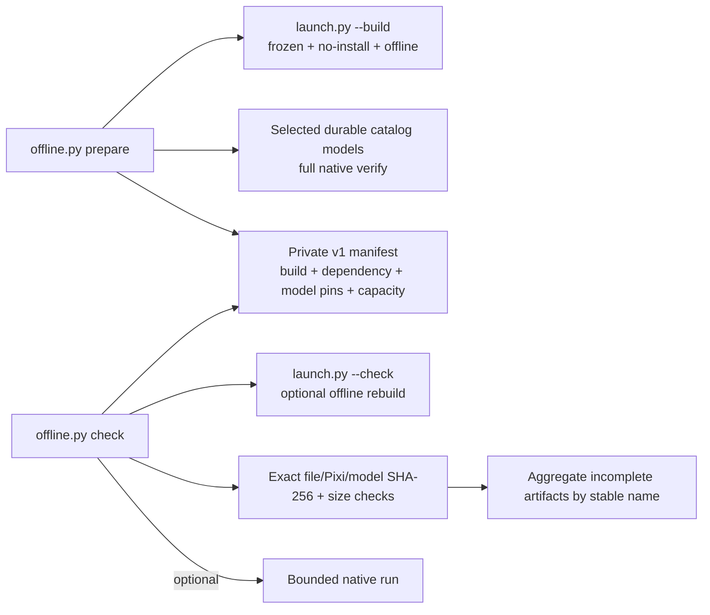
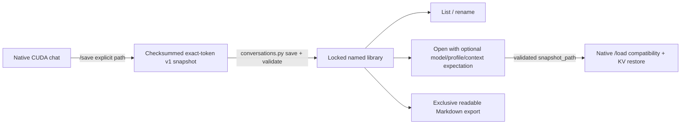
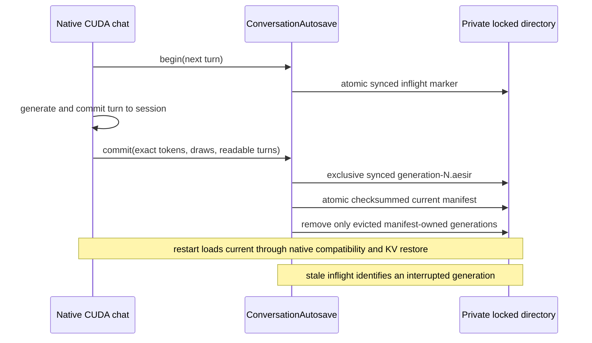
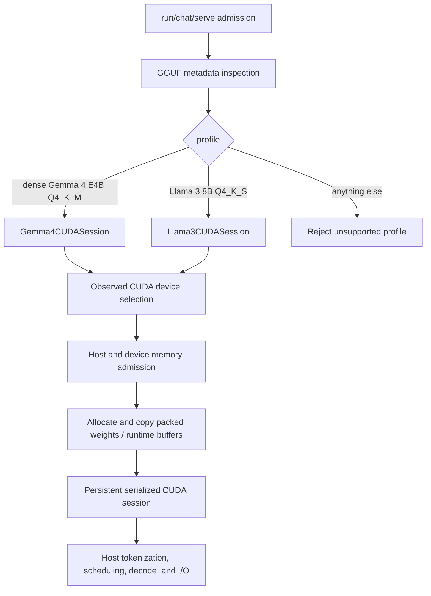
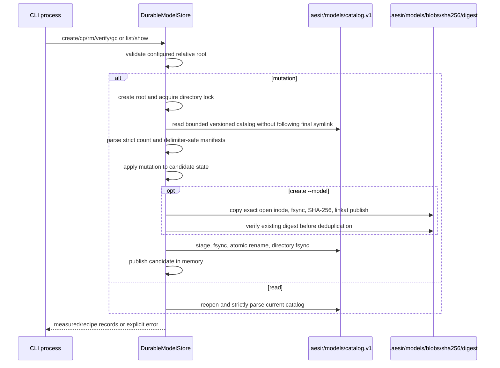
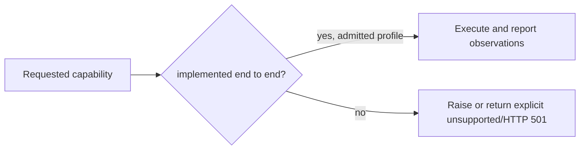

# Project A.E.S.I.R. current data flows

**Current as of September 22, 2026.** This map describes executable paths in the
current repository. The [capability ledger](../CAPABILITY_LEDGER.md) remains the
authority for evidence status and limits. Vision documents describe direction;
they do not add runtime edges to this map.

## Command routing



`dispatch_command()` separates recognized options from positionals, validates
option ownership, and rejects accepted-but-unconnected intent before model
loading. `run` selects the CPU path or one of the two native CUDA profiles.
`chat` is CUDA-only. Reserved daemon, process-control, push, external-engine,
ONNX-execution, and swarm commands fail explicitly.

## Offline preparation and verification



Preparation consumes only already installed dependencies and model bytes; it
does not download, install, or accept licenses. Normal check verifies the
prepared build and all recorded artifacts. Optional `--rebuild` exercises the
locked compiler cache and optional `--inference` runs one selected pinned model
only after every integrity/capacity gate passes.

## Named conversation lifecycle



The library does not interpret token state beyond validating the native record;
native `/load` remains the only owner of complete compatibility admission and KV
mutation. Names are metadata, never filesystem paths.

## Native conversation autosave



The manifest, not directory enumeration, defines committed and retention-owned
files. A crash before manifest publication leaves the previous generation
authoritative; a crash after publication recovers the new complete generation.

## Public Hugging Face GGUF download

```mermaid
sequenceDiagram
    participant U as CLI caller
    participant C as dispatch_pull
    participant H as HuggingFaceSeer
    participant P as curl / sha256sum
    participant F as caller-selected filesystem
    participant S as DurableModelStore

    U->>C: owner/name, filename, revision, size, SHA-256, output
    C->>C: validate flags, duplicates, ranges, path intent
    C->>H: download_hf_model(...)
    H->>H: validate exact repository identity and immutable pin
    H->>F: open and lock deterministic partial; pin parent and stage descriptors
    H->>P: checked argv; HTTPS-only transfer to inherited stage descriptor
    opt 2..8 connections
        H->>P: bounded HTTP byte ranges
        H->>F: verify each range and assemble in order
    end
    H->>F: verify byte count and GGUF v3 header through opened descriptor
    H->>P: calculate SHA-256 through inherited descriptor
    H->>F: fsync and hard-link exact verified inode without overwrite
    opt --name registration
        C->>S: preflight selected store before transfer
        C->>S: remeasure inode with pinned SHA-256/size admission
        S->>S: publish immutable blob and atomic catalog record
    end
    H-->>U: verified size, digest, and revision
```

The downloader handles one public, pinned GGUF artifact. Its default
single-connection mode safely continues an owned, regular, single-link partial;
an interrupted transfer preserves only a correctly bounded partial whose path
still names the locked inode. Parallel mode restarts from zero. The downloader
does not use a shell, accept insecure redirects, overwrite a destination,
populate engine memory, authenticate to the Hub, or infer model compatibility
from its name. Explicit `--name` registration copies and remeasures the verified
download in protected content-addressed storage; it does not remove the
caller-owned destination.

## Native CPU GGUF inference

```mermaid
sequenceDiagram
    participant U as run caller
    participant E as AesirEngine
    participant G as GGUFSeer
    participant T as RuneWeaver
    participant M as MimirWell / KVCache
    participant I as forward_pass

    U->>E: model path, prompt, max tokens
    E->>E: reject accelerator/NPU/multi-device intent
    E->>G: open and read-only mmap GGUF
    G->>G: parse bounded metadata, vocabulary, tensor descriptors
    G->>M: copy/convert admitted tensors into owned arena regions
    E->>T: encode prompt
    E->>M: allocate request-owned KV cache
    loop prompt prefill and greedy generation
        E->>I: token history, absolute position, model descriptors, KV
        I->>M: use request workspace; retain KV positions
        I-->>E: argmax token ID
        E->>T: decode visible token text
        E->>E: apply EOS/token/string/context/length stop policy
    end
    E->>M: restore arena to runtime offset
    E-->>U: GenerationResult
```

The external `E-REAL` fixture establishes this narrow F16 CPU path. Logical
host sharding tests prove partition arithmetic and sequential host reconstruction
only. They do not create concurrent workers or execute on multiple GPUs.

## Native CUDA inference profiles



Both profile implementations keep packed model weights, activations, KV cache,
model math, logits, and token selection on the selected NVIDIA device. Host code
owns admission, tokenization, scheduling, decoded output, transcripts, deadlines,
and Ctrl+C observation. There is no CPU fallback after CUDA admission and no
in-flight kernel preemption. Unsupported architecture, quantization, context,
memory, or device combinations fail before claiming execution.

Interactive and prompt-file chat retain one loaded CUDA session across turns.
`/clear` resets session state while keeping weights loaded. A cancelled decode
closes the turn; cancellation during prefill marks the session reset-required.
The documented Gemma and Stheno 20-turn transcripts are evidence for their exact
profiles and hardware, not for arbitrary GGUF models.

## Authenticated native loopback service

```mermaid
sequenceDiagram
    participant O as Operator
    participant S as native_serve
    participant L as local_transport / local_protocol
    participant E as ControlledTextSession
    participant C as Client

    O->>S: serve model --accel cuda --api-key-file private-file
    S->>S: validate key file, model profile, device, memory, limits
    S->>L: bind authenticated IPv4 loopback listener
    C->>L: bounded HTTP request + bearer credential
    L->>L: parse strict request line, headers, length, and flat JSON
    L->>L: constant-time compare equal-length credentials
    L->>E: begin one serialized stateless generation request
    loop until stop, deadline, cancellation, or error
        L->>E: next_chunk()
        E-->>L: decoded text chunk / status
    end
    L-->>C: bounded HTTP response
    L->>L: record sequence, phase, status, elapsed time; omit prompt/response/key
```

The service supports one serialized request at a time and resets the model
session between requests. It has strict I/O and generation deadlines and
cooperative shutdown. It is not the legacy `BifrostGate` route scaffold and
does not claim OpenAI, Ollama, or llama.cpp compatibility. Those legacy-shaped
routes return HTTP 501.

## Durable catalog and content-addressed blobs



Catalog records contain validated Modelfile recipes. Recipe-only records use a
deterministic non-cryptographic fingerprint. `create --model` records measured
SHA-256 and size for an immutable shared blob, and `verify` performs a full
rehash. Explicit pinned pull registration works. `gc` locks the store, validates
the catalog reference set plus every NUL-delimited directory entry before its
first unlink, removes only unreachable canonical blobs and abandoned stages, and
syncs the directory. `ps`, `stop`, upload, and live session ownership are not
implemented.

All persisted text paths cross `core/text_admission.mojo` after bounded file
reads and before parser access. Configuration, catalog, preferences,
conversation snapshots and StateVault markers reject NUL and non-scalar or
non-canonical UTF-8 before String construction. Catalog manifests, preference
values and conversation fields cross the same boundary again after hex decode.
Format owners then enforce exact schema/checksum/record counts, so trailing
bytes cannot become hidden committed state.

## Standalone local primitives

- `StateVault` persists a strict versioned marker containing token position,
  prompt count, timestamp, and an FNV-1a corruption checksum. Writes use staged
  sync, atomic same-directory replacement, and directory sync. No generation
  loop automatically consumes the marker, and it contains no model, tensor, KV,
  sampler, process, thread, or socket state.
- `AesirEventBus` is a bounded synchronous in-process journal with filtered
  subscriber mailboxes. It has no worker, lock, acknowledgement, retry, durable
  replay, or cross-process delivery.
- `RuneThreadPool` stores bounded task descriptors and cancellation/admission
  state. It creates no worker and executes no payload.
- `ErrorGuard` offers sentinel-address and one-index predicates plus NaN/Inf
  replacement for a valid caller-owned Float16 span. It is not wired into the
  current generation loops and cannot prove pointer provenance or alignment.
- `SkaldbrodirDetector`, thought redaction, strict tool-call JSON, grammar token
  text masking, and speculative acceptance arithmetic are bounded standalone
  components. Their wider model-loop integrations remain absent as specified in
  the ledger.

## Explicitly absent execution edges



There is no execution edge for AMD HIP, Intel Level Zero, Apple Metal, NPU,
multi-GPU, MAX graph execution, ONNX graphs, EXL2, llama.cpp delegation, swarm
networking, automatic RAG ingestion, speculative model execution, general GBNF,
tool execution, or the experimental CIA/WIC/NSFI/MQARI ideas. Descriptor,
parser, formatter, and arithmetic primitives for some of these areas do not
become runtime support unless the ledger records the corresponding end-to-end
evidence.
