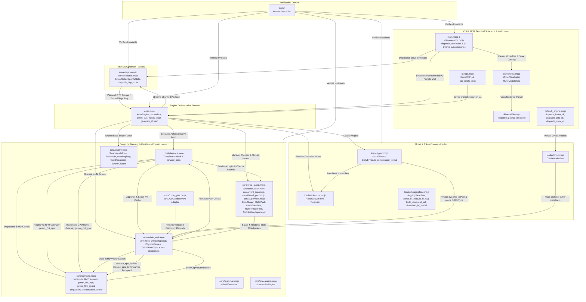
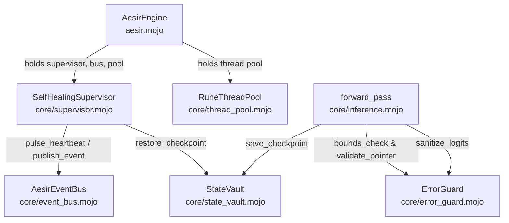
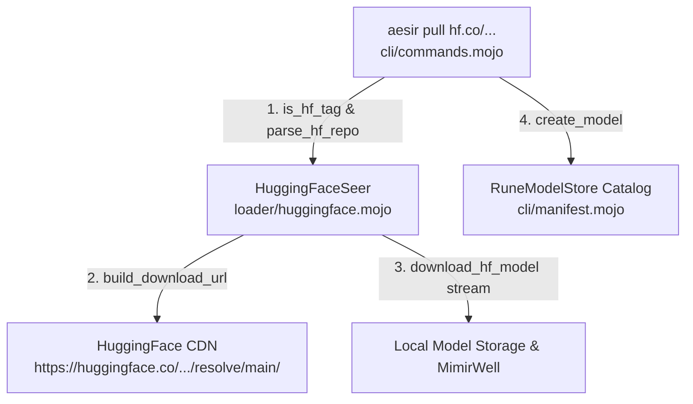
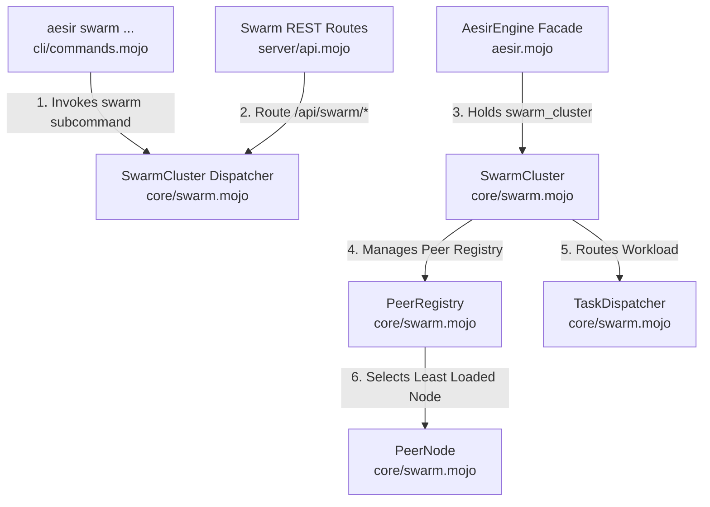

# Project Aesir: Domain Ownership Map & Target Boundary Law

> *"Let every realm maintain its own walls. When boundaries collapse, chaos reigns."*  
> — **Rúnhild Svartdóttir, The Architect**

---

## 🏛️ Domain Architecture Overview

Project Aesir is strictly partitioned into isolated domain realms. Each domain has a single, immutable responsibility and communicates only through explicit facade interfaces.

> [!IMPORTANT]
> This map assigns ownership and preserves intended interface shapes. It is not
> a capability-completion matrix. Reserved commands/routes and named hardware,
> ecosystem, resilience, and Swarm types may fail closed or remain local
> descriptors. Current operational status is defined only by
> [`CAPABILITY_LEDGER.md`](../CAPABILITY_LEDGER.md).

---

## 📜 Domain Boundary Rules, Slice 6, Slice 7, Slice 8, Slice 9, Slice 10, Slice 11, Slice 12, Slice 13 & Phase 14 Confirmations

### 1. `server` Domain (BifrostGate Transport, OpenAI v1 Protocol Bridge & API Formatting)
- **Path:** `aesir_engine/server/`
- **Owner:** Network & Transport Layer
- **Responsibility:** Listens on POSIX sockets (`127.0.0.1:11434`), accepts HTTP requests, formats JSON responses, and manages client socket lifetimes. Provides `send_chunk` / `@staticmethod send_chunk_static` for chunked SSE streaming and `send_embeddings_response` / `@staticmethod send_embeddings_response_static` for formatting Ollama-compatible `/api/embeddings` JSON responses. In **Slice 11**:
  - `OpenAIGate` (`server/openai.mojo`): Protocol bridge formatting OpenAI v1 REST JSON payloads (`format_chat_completion`, `format_chat_chunk`, `format_models_list`, `format_embeddings`).
  - `BifrostGate.dispatch_http_route()` (`server/api.mojo`): Universal REST API router handling requests across Ollama, OpenAI v1 (`/v1/chat/completions`, `/v1/models`, `/v1/embeddings`), llama.cpp Server HTTP endpoints (`/completion`, `/tokenize`, `/detokenize`, `/infill`, `/health`, `/props`, `/slots`, `/metrics`), and **Phase 14 Swarm REST API routes** (`/api/swarm/nodes`, `/api/swarm/join`, `/api/swarm/dispatch`, `/api/swarm/status`).
- **Forbidden:** Must NEVER import `core/compute.mojo`, `core/inference.mojo`, or access `MimirWell` / `MimirStore` / `KVCache` / `DeviceTopology` / `NPUBackendType` / `NPUBuffer` / `GPURealmType` / `GPUBuffer` / `CompressedFormatType` / `SwarmCluster` directly. Must ONLY communicate via `AesirEngine` in `aesir.mojo`.

### 2. `asgard` Domain (AesirEngine Orchestration Facade, RAG, Resilience, Multi-Device Topology & Swarm Mesh Orchestration)
- **Path:** `aesir_engine/aesir.mojo`
- **Owner:** Engine Orchestration & Lifecycle
- **Responsibility:** Instantiates the engine's local components and coordinates the verified single-device CPU generation path. Multi-device, NPU, GPU, live server, concurrency, and swarm surfaces remain rejected or scaffolded according to the capability ledger.
- **Slice 6 Components:** `AesirEngine` holds `topology: DeviceTopology` initialized via `num_devices` parameter. When `num_devices > 1`, logs active Bifrost Shard Matrix status and passes `topology` into `forward_pass()` calls during inference.
- **Slice 7 Components (NPU Realm Gateway):** `AesirEngine` holds `enable_npu: Bool` and `target_backend: NPUBackendType`. When `enable_npu` is `True`, logs the active NPU backend name via `target_backend.name()` at construction time and passes `use_npu=enable_npu` and `npu_backend=target_backend` into every `forward_pass()` call. `NPUBackendType` is imported from `core/mimir_well.mojo`.
- **Slice 8 Components:** `AesirEngine` retains requested GPU configuration fields, but validation rejects GPU execution before model loading. GPU-1 discovery lives in the core topology boundary and does not enable these fields.
- **Slice 12 Components (Sovereign Resilience & Self-Healing Matrix):** `AesirEngine` holds `supervisor: SelfHealingSupervisor`, `event_bus: AesirEventBus`, and `thread_pool: RuneThreadPool`. Emits an initial heartbeat pulse on startup and maintains thread pool resources for concurrent inference requests.
- **Phase 14 Components (Autonomous Swarm Agents & Enterprise Mesh Cluster Matrix):** `AesirEngine` holds `swarm_cluster: SwarmCluster`. Instantiates the swarm orchestrator on startup and manages mesh cluster topology.

### 3. `loader` Domain (GGUFSeer, GGMLType, ONNXModelSeer, HuggingFaceSeer & RuneWeaver BPE Tokenizer)
- **Path:** `aesir_engine/loader/`
- **Owner:** Disk Mapping, Model Stream Resolution & Token Translation
- **Responsibility:** `GGUFSeer` parses GGUF binary headers (magic `0x46554747`, version, KV pairs via `skip_value`, tensor shapes/types) and maps model weights into `MimirWell` via `mmap`. `GGMLType` (in `loader/gguf.mojo`) provides `@staticmethod to_compressed_format(ggml_type: UInt32) -> CompressedFormatType` mapping binary GGUF quantization IDs to `CompressedFormatType` discriminants. In **Slice 11**, `ONNXModelSeer` (`loader/onnx.mojo`) parses ONNX model protocol buffer headers (`parse_onnx_header`) and maps initializers into `MimirWell` (`map_to_well`). `RuneWeaver` (`loader/tokenizer.mojo`) provides a pure Mojo BPE tokenizer with `add_token()`, `byte_to_hex_token()` (`<0xXX>`), `encode()` (BPE merging), and `decode()` (token ID to text string). In **Slice 13**, `HuggingFaceSeer` (`loader/huggingface.mojo`) provides repository URI parsing (`parse_hf_repo`), tag discriminant check (`is_hf_tag`), CDN stream URL construction (`build_download_url`), and bare-metal weight stream downloading (`download_hf_model`).
- **Forbidden:** Must NEVER execute compute kernels, manage server sockets, or depend on higher-level CLI catalog structs (`RuneModelStore`).

### 4. `core` Domain (Nidavellir SIMD Kernels, MimirWell, KVCache, MimirStore, NPU Gateway, GPU Realm Matrix, Compressed Format Matrix, GBNFGrammar, SpeculativeEngine, Sovereign Resilience Matrix & Swarm Cluster Matrix)
- **Path:** `aesir_engine/core/`
- **Owner:** Math, Zero-Allocation Memory, Quantization Unpacking, Constrained Generation, Self-Healing Resilience, Swarm Mesh Cluster & Transformer Forward Pass
- **Responsibility:** `MimirWell` pre-allocates contiguous host workspace. `core/mimir_well.mojo` owns memory types, runtime-neutral discovery records, topology, sharding, and partitioning. `core/cuda_gate.mojo` owns real MAX CUDA enumeration and capability inspection. `core/compute.mojo` owns CPU SIMD kernels and fail-closed accelerator gateways; `core/inference.mojo` owns `TransformerBlock` and `forward_pass`.
  - **Slice 7 — NPU Realm Gateway additions:** `NPUBackendType`, `NPUBuffer`, `DeviceTopology.detect_edge_npus()`, `MimirWell.allocate_npu_buffer()`, `gemm_f16_arm_neon`, `rmsnorm_arm_neon`, `gemm_f16_npu`.
  - **Slice 8 / GPU-1:** `GPURealmType` and host `GPUBuffer` descriptors remain reserved execution surfaces. GPU-1 adds `DiscoveryStatus`, `DeviceCapabilities`, `PhysicalDevice`, `HardwareDiscoveryResult`, real MAX CUDA enumeration, accumulation, and compatible-device selection. GPU compute remains fail-closed.
  - **Slice 10 — Universal Compressed LLM Format Matrix additions:** `CompressedFormatType` in `core/mimir_well.mojo`, `dequantize_compressed_tensor` gate and SIMD unpacking kernels in `core/compute.mojo`.
  - **Slice 11 — Constrained Generation & Speculative Sampling additions:** `GBNFGrammar` (`core/grammar.mojo`), `SpeculativeEngine` (`core/speculative.mojo`).
  - **Slice 12 — Sovereign Resilience & Self-Healing Matrix additions:** `ErrorGuard`, `StateVault`, `AesirEventBus`, `RuneThreadPool`, `SelfHealingSupervisor`.
  - **Phase 14 — Autonomous Swarm Agents & Enterprise Mesh Cluster Matrix additions:** `SwarmNodeRole`, `PeerNode`, `PeerRegistry`, `TaskDispatcher`, `SwarmCluster` (`core/swarm.mojo`). Manages node roles (LEADER, WORKER, RELAY), peer node state & VRAM metrics, registry indexing, dynamic least-loaded node selection, and inter-node task dispatching.
- **Forbidden:** Must NEVER make network calls, read disk files, or dynamically allocate memory during inference.

### 5. `cli` Domain (The Ollama, Multi-Engine & Swarm CLI Terminal Suite — Slice 9, Slice 11, Slice 13 & Phase 14)
- **Path:** `aesir_engine/cli/` & `aesir_engine/main.mojo`
- **Owner:** CLI & Terminal Command Suite
- **Responsibility:** Parses command-line invocation arguments (`main.mojo`), dispatches commands to handlers (`dispatch_command`), parses Modelfiles (`Modelfile`, `parse_modelfile`), manages model catalog and manifests (`ModelManifest`, `RuneModelStore`), runs interactive chat REPL session (`RuneREPL`), and executes single-shot queries (`run_single_shot`). Dispatches all standard Ollama terminal commands (`serve`, `run`, `pull`, `push`, `create`, `list`/`ls`, `ps`, `rm`/`delete`, `cp`, `show`, `stop`, `help`), multi-engine commands (`dispatch_llama_cli`, `dispatch_exl2_cli`, `dispatch_onnx_cli`), and **Phase 14 `swarm` subcommand** (`aesir swarm join`, `aesir swarm list`, `aesir swarm status`, `aesir swarm dispatch`).
- **Forbidden:** Must NEVER import `core/compute.mojo`, `core/inference.mojo`, or `core/mimir_well.mojo` directly. Communicates with inference strictly via `AesirEngine` in `aesir.mojo` and with transport via `BifrostGate` in `server/api.mojo`.

### 6. `tests` Domain (Verification Suite)
- **Path:** `aesir_engine/tests/`
- **Owner:** Quality & Invariants
- **Responsibility:** Verifies CPU math, memory, loading, tokenization, inference, and fail-closed subsystem contracts. Discovery admission and selection use injected records in the hardware-independent master suite; opt-in tests separately prove physical MAX CUDA discovery and GPU-0 kernel reachability. Those tests do not promote production GPU execution.

---

## 🛡️ Sovereign Resilience & Self-Healing Matrix — Slice 12 Domain Layer & Boundary Confirmations

The Sovereign Resilience & Self-Healing Matrix establishes a fault-tolerant, self-healing runtime substrate within the `core` domain. It guarantees zero-downtime inference, defensive memory boundaries, NaN/Inf logit cleansing, state snapshotting, and thread pool worker management.

**Boundary confirmation for Slice 12:**

| Component | Placed in | Domain | Verdict |
| :--- | :--- | :--- | :--- |
| `ErrorGuard` | `core/error_guard.mojo` | Core — Defensive Memory & Safety | ✅ **Correct** — pointer alignment & logit sanitization belongs in core safety |
| `StateVault` | `core/state_vault.mojo` | Core — State Checkpointing | ✅ **Correct** — zero-allocation state snapshotting belongs in core state domain |
| `AesirEventBus` | `core/event_bus.mojo` | Core — Event Infrastructure | ✅ **Correct** — inter-module Pub/Sub event messaging belongs in core |
| `RuneThreadPool` | `core/thread_pool.mojo` | Core — Concurrency & Work Stealing | ✅ **Correct** — parallel worker execution belongs in core compute pool |
| `SelfHealingSupervisor` | `core/supervisor.mojo` | Core — Process Guardianship | ✅ **Correct** — crash monitoring & recovery supervisor belongs in core |
| `AesirEngine` fields (`supervisor`, `event_bus`, `thread_pool`) | `aesir.mojo` | Asgard Facade Domain | ✅ **Correct** — orchestration facade owns system-wide component instances |
| `test_resilience.mojo` | `tests/test_resilience.mojo` | Testing Domain | ✅ **Correct** — resilience unit tests belong in test suite |

---

## 🌐 HuggingFace Hub Integration & Mobile Model Downloader — Slice 13 Domain Layer & Boundary Confirmations

The HuggingFace Hub Integration & Mobile Model Downloader establishes sovereign repository tag resolution, direct CDN weight URL construction, and bare-metal weight stream ingestion for mobile & edge models (SmolLM, MobileLLM, Llama-3.2, Qwen2.5, Gemma-2-2B, Phi-3.5-mini) within the `loader` domain.

**Boundary confirmation for Slice 13:**

| Component | Placed in | Domain | Verdict |
| :--- | :--- | :--- | :--- |
| `HuggingFaceSeer` | `loader/huggingface.mojo` | Loader — Stream Downloader & Resolver | ✅ **Correct** — weight stream downloading and repo tag resolution belong in loader domain |
| `parse_hf_repo` | `loader/huggingface.mojo` | Loader — URI Normalization Rune | ✅ **Correct** — repo string normalization belongs in loader resolution |
| `is_hf_tag` | `loader/huggingface.mojo` | Loader — Tag Discriminant Rune | ✅ **Correct** — URI pattern discrimination belongs in loader resolution |
| `build_download_url` | `loader/huggingface.mojo` | Loader — CDN URL Builder Rune | ✅ **Correct** — CDN endpoint resolution belongs in loader resolution |
| `download_hf_model` | `loader/huggingface.mojo` | Loader — Stream Downloader | ✅ **Correct** — bare-metal streaming weight downloader belongs in loader |
| HuggingFace CLI Dispatch (`pull`) | `cli/commands.mojo` | CLI — Subcommand Dispatcher | ✅ **Correct** — CLI tag routing and RuneModelStore catalog inscription belong in CLI domain |
| `test_huggingface.mojo` | `tests/test_huggingface.mojo` | Testing Domain | ✅ **Correct** — HuggingFace integration unit tests belong in test suite |

---

## 🐝 Autonomous Swarm Agents & Enterprise Mesh Cluster Matrix — Phase 14 Domain Layer & Boundary Confirmations

The Autonomous Swarm Agents & Enterprise Mesh Cluster Matrix establishes cluster topology management, peer discovery, liveness heartbeats, and dynamic workload dispatching across enterprise mesh nodes within the `core` domain (`core/swarm.mojo`).

**Boundary confirmation for Phase 14:**

| Component | Placed in | Domain | Verdict |
| :--- | :--- | :--- | :--- |
| `SwarmNodeRole` | `core/swarm.mojo` | Core — Swarm Domain | ✅ **Correct** — node role discriminant belongs in core swarm module |
| `PeerNode` | `core/swarm.mojo` | Core — Swarm Domain | ✅ **Correct** — peer node descriptor belongs in core swarm module |
| `PeerRegistry` | `core/swarm.mojo` | Core — Swarm Domain | ✅ **Correct** — peer node registry and load balancer belong in core swarm module |
| `TaskDispatcher` | `core/swarm.mojo` | Core — Swarm Domain | ✅ **Correct** — dynamic task router belongs in core swarm module |
| `SwarmCluster` | `core/swarm.mojo` | Core — Swarm Domain | ✅ **Correct** — swarm orchestrator belongs in core swarm module |
| Swarm REST API routes | `server/api.mojo` | Server — Transport & Routing Domain | ✅ **Correct** — REST routes (`/api/swarm/*`) belong in server transport layer |
| Swarm CLI subcommand (`swarm`) | `cli/commands.mojo` | CLI — Subcommand Dispatcher | ✅ **Correct** — CLI command routing belongs in CLI domain |
| `AesirEngine.swarm_cluster` | `aesir.mojo` | Asgard Facade Domain | ✅ **Correct** — orchestration facade owns cluster orchestrator instance |
| `test_swarm_cluster.mojo` | `tests/test_swarm_cluster.mojo` | Testing Domain | ✅ **Correct** — swarm unit tests belong in test suite |

---

## 🔍 Domain Responsibilities & Interface Summary

| Domain | Files | Core Structs / Functions | Interface Document |
| :--- | :--- | :--- | :--- |
| **CLI** | `cli/modelfile.mojo`, `cli/manifest.mojo`, `cli/repl.mojo`, `cli/commands.mojo`, `cli/multi_engine.mojo` *(Slice 11)*, `main.mojo` | `Modelfile`, `parse_modelfile`, `ModelManifest`, `RuneModelStore`, `RuneREPL`, `run_single_shot`, `dispatch_command`, `dispatch_llama_cli` *(Slice 11)*, `dispatch_exl2_cli` *(Slice 11)*, `dispatch_onnx_cli` *(Slice 11)*, `aesir swarm` *(Phase 14)* | `cli/INTERFACE.md` |
| **Server** | `server/api.mojo`, `server/openai.mojo` *(Slice 11)* | `BifrostGate`, `dispatch_http_route` *(Slice 11)*, `/api/swarm/*` *(Phase 14)*, `send_chunk`, `send_chunk_static`, `send_embeddings_response`, `send_embeddings_response_static`, `OpenAIGate` *(Slice 11)* | `server/INTERFACE.md` |
| **Facade** | `aesir.mojo` | `AesirEngine`, `topology: DeviceTopology`, `enable_npu: Bool` *(Slice 7)*, `target_backend: NPUBackendType` *(Slice 7)*, `enable_gpu_realm: Bool` *(Slice 8)*, `target_gpu_realm: GPURealmType` *(Slice 8)*, `supervisor: SelfHealingSupervisor` *(Slice 12)*, `event_bus: AesirEventBus` *(Slice 12)*, `thread_pool: RuneThreadPool` *(Slice 12)*, `swarm_cluster: SwarmCluster` *(Phase 14)*, `generate`, `generate_stream`, `knowledge_base` (RAG Context Augmentation) | Root `ARCHITECTURE.md` |
| **Loader** | `loader/gguf.mojo`, `loader/tokenizer.mojo`, `loader/onnx.mojo` *(Slice 11)*, `loader/huggingface.mojo` *(Slice 13)* | `GGUFSeer`, `RuneWeaver` (BPE `encode`/`decode`/`<0xXX>`), `GGMLType` (+ `to_compressed_format` *Slice 10*), `ONNXModelSeer` *(Slice 11)*, `HuggingFaceSeer` *(Slice 13)* (`parse_hf_repo`, `is_hf_tag`, `build_download_url`, `download_hf_model`) | `loader/INTERFACE.md` |
| **Core** | `core/mimir_well.mojo`, `core/compute.mojo`, `core/inference.mojo`, `core/grammar.mojo` *(Slice 11)*, `core/speculative.mojo` *(Slice 11)*, `core/error_guard.mojo` *(Slice 12)*, `core/state_vault.mojo` *(Slice 12)*, `core/event_bus.mojo` *(Slice 12)*, `core/thread_pool.mojo` *(Slice 12)*, `core/supervisor.mojo` *(Slice 12)*, `core/swarm.mojo` *(Phase 14)* | `MimirWell` (+ `allocate_npu_buffer` *Slice 7*, `allocate_gpu_buffer` *Slice 8*), `RuneTensor`, `KVCache`, `MimirStore`, `DeviceTopology` (+ `npu_backends` *Slice 7*, `gpu_realms` *Slice 8*), `ShardTensor`, `NPUBackendType` *(Slice 7)*, `NPUBuffer` *(Slice 7)*, `GPURealmType` *(Slice 8)*, `GPUBuffer` *(Slice 8)*, `CompressedFormatType` *(Slice 10)*, `GBNFGrammar` *(Slice 11)*, `SpeculativeEngine` *(Slice 11)*, `ErrorGuard` *(Slice 12)*, `StateVault` *(Slice 12)*, `AesirEventBus` *(Slice 12)*, `RuneThreadPool` *(Slice 12)*, `SelfHealingSupervisor` *(Slice 12)*, `SwarmNodeRole` *(Phase 14)*, `PeerNode` *(Phase 14)*, `PeerRegistry` *(Phase 14)*, `TaskDispatcher` *(Phase 14)*, `SwarmCluster` *(Phase 14)*, SIMD Kernels, `TransformerBlock`, `forward_pass` | `core/INTERFACE.md` |
| **Tests** | `tests/run_all.mojo`, `test_*.mojo` | `main()`, test cases (`test_compute`, `test_gguf`, `test_tokenizer`, `test_inference`, `test_kv_cache`, `test_rag`, `test_sharding`, `test_npu_edge`, `test_gpu_realms`, `test_cli`, `test_quantization` *Slice 10*, `test_multi_engine` *Slice 11*, `test_resilience` *Slice 12*, `test_huggingface` *Slice 13*, `test_swarm_cluster` *Phase 14*) | `tests/INTERFACE.md` |

