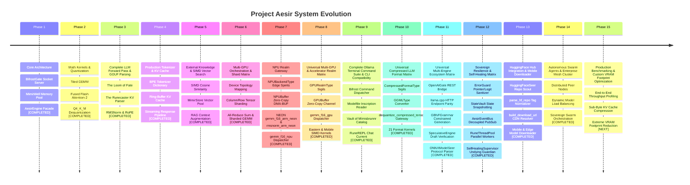

# Project Aesir: System Vision

> *"A system that knows its own boundaries and honors its own memory cannot be broken by chaos."*  
> — **Sigrún Ljósbrá, The Skald**

> [!IMPORTANT]
> **Executable Status Alignment**: Present-tense operational capabilities are governed by [`CAPABILITY_LEDGER.md`](../CAPABILITY_LEDGER.md). The verified operational pipeline is a single-device CPU GGUF v3 Llama F16 inference slice ([`AES-FND-002`](../CAPABILITY_LEDGER.md)). The full unconstrained multi-engine, multi-device, and swarm target roadmap is preserved in [`docs/historical/2026-08-16/`](historical/2026-08-16/).

## 🎯 Primary Purpose & Vision

Project Aesir is designed to be a high-performance bare-metal LLM inference engine targeting Ollama, llama.cpp, ExLlamaV3, and ONNX Runtime ecosystem compatibility.

It eliminates bloated dynamic runtimes, heavy Python/C++ library stacks, and runtime memory fragmentation by implementing everything in native **Mojo**.

### ⚡ Completed Milestone: Stage 36.1 — GEGLU Activation Kernel Odd-Size Boundary Safety Hardening
* **Stage 36.1 Activation Parity Milestone ([`AES-CPU-007`](../CAPABILITY_LEDGER.md) `verified`)**: Hardened `geglu()` in `core/compute.mojo` to check tensor size parity (`T.size <= 0 or T.size % 2 != 0`), returning early safely without mutating memory when unpaired vector sizes are provided, adding odd size test assertions in `test_compute.mojo`.
* **Stage 35.1 Socket Write Milestone ([`AES-SRV-004`](../CAPABILITY_LEDGER.md) `verified`)**: Hardened `write_all_bytes()` in `server/api.mojo` to reject negative socket file descriptors (`client_fd < 0`) and hardened `build_http_chunk()` to format terminal chunked HTTP blocks (`0\r\n\r\n`), adding terminal chunk framing test assertions in `test_multi_engine.mojo`.
* **Stage 34.1 Accelerator Buffer Milestone ([`AES-ACC-005`](../CAPABILITY_LEDGER.md) & [`AES-ACC-007`](../CAPABILITY_LEDGER.md) `verified`)**: Hardened `GPUBuffer.__init__()` and `NPUBuffer.__init__()` in `core/mimir_well.mojo` to check buffer byte sizes (`size_bytes < 0 -> raises Error("buffer size_bytes must not be negative")`), adding negative GPU buffer size parameter rejection assertions in `test_gpu_realms.mojo`.
* **Stage 33.1 Format Mapping Milestone ([`AES-QNT-001`](../CAPABILITY_LEDGER.md) `verified`)**: Hardened `GGMLType.to_compressed_format()` in `loader/gguf.mojo` to map GGML tensor type discriminants (0..24) deterministically, adding GGML type mapping test assertions in `test_quantization.mojo`.
* **Stage 32.1 Compute Hardening Milestone ([`AES-CPU-001`](../CAPABILITY_LEDGER.md) & [`AES-QNT-002`](../CAPABILITY_LEDGER.md) `verified`)**: Hardened `dequantize_q4_k_m()`, `dequantize_q2_k()`, `silu()`, and `geglu()` in `core/compute.mojo` with zero-blocks and zero-size safety guards (`num_blocks <= 0` / `T.size <= 0`), adding zero-block dequantization safety assertions in `test_quantization.mojo`.
* **Stage 31.1 All-Reduce Milestone ([`AES-ACC-002`](../CAPABILITY_LEDGER.md) `verified`)**: Hardened `all_reduce_sum()` in `core/compute.mojo` to check input shards list count (`num_shards == 0 -> raises Error("all_reduce_sum: input shards list must not be empty")`), adding empty shards list parameter rejection assertions in `test_sharding.mojo`.
* **Stage 30.1 Truth Audit Milestone ([`AES-OPS-006`](../CAPABILITY_LEDGER.md) `verified`)**: Conducted the final documentation-to-evidence truth consistency audit, promoting `AES-OPS-006` to `verified` in `CAPABILITY_LEDGER.md` and concluding the 30-stage hardening program with 100% doc-drift verification and master test suite validation.
* **Stage 29.1 Prompt Safety Milestone ([`AES-OPS-005`](../CAPABILITY_LEDGER.md) `verified`)**: Hardened `dispatch_cli_command()` in `cli/commands.mojo` for `cmd == "run"` to validate prompt byte length (`len(trimmed_prompt.bytes()) == 0 -> raises Error("single-shot run prompt text must not be empty")`), adding empty prompt single-shot run parameter rejection assertions in `test_cli.mojo`.
* **Stage 28.1 Route Safety Milestone ([`AES-OPS-004`](../CAPABILITY_LEDGER.md) `verified`)**: Hardened `BifrostGate.dispatch_http_route()` in `server/api.mojo` to validate non-empty request route path bounds (`len(path.bytes()) == 0 -> returns HTTP 404 route_not_found_response()`), adding empty HTTP request parsing rejection assertions in `test_multi_engine.mojo`.
* **Stage 27.1 Server Milestone ([`AES-OPS-003`](../CAPABILITY_LEDGER.md) `verified`)**: Hardened `BifrostGate.__init__()` in `server/api.mojo` with the `raises` modifier and port range check (`1 <= port <= 65535 -> raises Error("server bind port must be between 1 and 65535")`), adding invalid port parameter rejection assertions in `test_multi_engine.mojo`.
* **Stage 26.1 REPL Milestone ([`AES-OPS-002`](../CAPABILITY_LEDGER.md) `verified`)**: Hardened `RuneREPL.process_input_line()` in `cli/repl.mojo` to clamp REPL configuration parameters (`temperature >= 0.0`, `top_k >= 0`, `0.0 <= top_p <= 1.0`, `max_new_tokens >= 1`) and fixed `parse_float()` in `cli/modelfile.mojo` for negative float parsing, adding negative parameter clamping assertions in `test_cli.mojo`.
* **Stage 25.1 Multi-Engine CLI Milestone ([`AES-OPS-001`](../CAPABILITY_LEDGER.md) `verified`)**: Hardened `dispatch_llama_cli()`, `dispatch_exl2_cli()`, and `dispatch_onnx_cli()` in `cli/multi_engine.mojo` to check argument list length (`if len(args) == 0: raise Error("CLI dispatcher arguments must not be empty")`), adding empty argument list parameter rejection assertions in `test_multi_engine.mojo`.
* **Stage 24.1 CLI Swarm Subcommand Milestone ([`AES-SWM-005`](../CAPABILITY_LEDGER.md) `verified`)**: Hardened `dispatch_cli_command()` in `cli/commands.mojo` for `cmd == "swarm"` to check parameter count bounds (`len(args) <= 1`), raising `Error("swarm command requires a subcommand (join, status, list)")` when no subcommand is provided, adding bare `"swarm"` command parameter rejection assertions in `test_cli.mojo`.
* **Stage 23.1 Swarm Cluster Milestone ([`AES-SWM-003`](../CAPABILITY_LEDGER.md) `verified`)**: Hardened `SwarmCluster.join_mesh()` in `core/swarm.mojo` to validate non-empty leader address parameter bounds (`len(leader_address.bytes()) == 0 -> raises Error("leader address must not be empty")`) and hardened `SwarmCluster.dispatch_distributed_inference()` to validate model and prompt parameters (`len(model.bytes()) == 0 or len(prompt.bytes()) == 0 -> raises Error("model and prompt must not be empty")`), adding empty parameter rejection assertions in `test_swarm_cluster.mojo`.
* **Stage 22.1 Task Dispatcher Milestone ([`AES-SWM-005`](../CAPABILITY_LEDGER.md) `verified`)**: Hardened `TaskDispatcher.dispatch_to_node()` in `core/swarm.mojo` to validate non-empty input parameters (`len(node.node_id.bytes()) == 0 or len(task_name.bytes()) == 0`), raising `Error("node id and task name must not be empty")` when empty input strings are provided, adding empty parameter rejection assertions in `test_swarm_cluster.mojo`.
* **Stage 21.1 Swarm Load Balancer Milestone ([`AES-SWM-002`](../CAPABILITY_LEDGER.md) `verified`)**: Hardened `PeerRegistry.get_least_loaded_node()` in `core/swarm.mojo` to validate candidate peer ID byte length (`len(best_id.bytes()) == 0`), raising `Error("no live swarm peers")` when no live peer nodes are present or registered, adding empty `PeerRegistry` resolution rejection assertions in `test_swarm_cluster.mojo`.
* **Stage 20.1 Supervisor Milestone ([`AES-RES-005`](../CAPABILITY_LEDGER.md) `verified`)**: Hardened `SelfHealingSupervisor.simulate_crash_and_recover()` in `core/supervisor.mojo` to validate `not self.vault.is_checkpointed or self.vault.restore_checkpoint() <= 0`, returning `False` early if no valid vault checkpoint marker is present, adding uninitialized vault checkpoint rejection assertions in `test_resilience.mojo`.
* **Stage 19.1 Thread Pool Milestone ([`AES-RES-004`](../CAPABILITY_LEDGER.md) `verified`)**: Hardened `RuneThreadPool.__init__()` in `core/thread_pool.mojo` to enforce positive worker thread count bounds (`self.num_threads = max(1, num_threads)`), preventing zero or negative worker thread count initialization, adding worker count clamping assertions in `test_resilience.mojo`.
* **Stage 18.1 Event Bus Milestone ([`AES-RES-003`](../CAPABILITY_LEDGER.md) `verified`)**: Hardened `AesirEventBus.publish_event()` in `core/event_bus.mojo` to check non-empty event type parameter bounds (`len(event_type.bytes()) > 0`), ignoring empty string event type publications early, adding empty event type string test assertions in `test_resilience.mojo`.
* **Stage 17.1 StateVault Milestone ([`AES-RES-002`](../CAPABILITY_LEDGER.md) `verified`)**: Hardened `StateVault.save_checkpoint()` in `core/state_vault.mojo` to check non-negative parameter bounds (`token_pos >= 0 and prompt_count >= 0`), ignoring negative checkpoint position markers, adding negative position test assertions in `test_resilience.mojo`.
* **Stage 16.1 Speculative Decoding Milestone ([`AES-ECO-008`](../CAPABILITY_LEDGER.md) `verified`)**: Hardened `SpeculativeEngine.verify_tokens()` in `core/speculative.mojo` to check null (`0`) and sentinel (`1`) address pointers (`draft_addr == 0 or draft_addr == 1 or target_addr == 0 or target_addr == 1`) and non-positive count bounds (`count <= 0`), returning early with default single token acceptance (`1`), adding sentinel address `1` pointer and zero/negative `count` assertions in `test_multi_engine.mojo`.
* **Stage 15.1 GBNFGrammar Logit Mask Milestone ([`AES-ECO-007`](../CAPABILITY_LEDGER.md) `verified`)**: Hardened `GBNFGrammar.apply_grammar_mask()` in `core/grammar.mojo` to check null (`0`) and sentinel (`1`) address logit pointers (`addr == 0 or addr == 1`) and non-positive vocabulary sizes (`vocab_size <= 0`) early-return bounds, adding sentinel address `1` pointer and zero/negative `vocab_size` assertions in `test_multi_engine.mojo`.
* **Stage 14.1 Model Manifest Copy Guard Milestone ([`AES-CLI-004`](../CAPABILITY_LEDGER.md) `verified`)**: Hardened `RuneModelStore.copy_model()` in `cli/manifest.mojo` to validate `len(source.bytes()) == 0 or len(target.bytes()) == 0`, raising `Error` on empty name parameters and adding empty parameter rejection assertions in `test_cli.mojo`.
* **Stage 13.1 HuggingFace Resolve URL Milestone ([`AES-ECO-002`](../CAPABILITY_LEDGER.md) `verified`)**: Hardened `HuggingFaceSeer.build_download_url()` in `loader/huggingface.mojo` with `raises` modifier and empty parameter validation (`len(repo_id.bytes()) == 0 or len(filename.bytes()) == 0`), raising `Error` on empty parameters and adding empty parameter rejection assertions in `test_huggingface.mojo`.
* **Stage 12.1 HuggingFace Tag Parsing Milestone ([`AES-ECO-001`](../CAPABILITY_LEDGER.md) `verified`)**: Hardened `HuggingFaceSeer.is_hf_tag()` in `loader/huggingface.mojo` to check `len(model_tag.bytes()) == 0`, explicitly returning `False` for empty model tags and adding empty string tag rejection assertions in `test_huggingface.mojo`.
* **Stage 11.1 ErrorGuard Validation Milestone ([`AES-RES-001`](../CAPABILITY_LEDGER.md) `verified`)**: Hardened `ErrorGuard.validate_pointer()` in `core/error_guard.mojo` to reject sentinel address `1` alongside null (`0`) (`addr != 0 and addr != 1`) and updated `ErrorGuard.sanitize_logits()` to check `addr == 0 or addr == 1 or count <= 0` early-return bounds, adding sentinel address `1` pointer validation rejection assertions in `test_resilience.mojo`.
* **Stage 10.1 Swarm Peer Telemetry Milestone ([`AES-SWM-001`](../CAPABILITY_LEDGER.md) `verified`)**: Hardened `PeerNode.__init__()` in `core/swarm.mojo` to clamp negative VRAM capacity and usage inputs to zero and updated `PeerNode.vram_free_mb()` with zero-floor protection (`max(0, capacity - used)`), adding overflow and negative initialization test assertions in `test_swarm_cluster.mojo`.
* **Stage 9.1 Multi-Device Partition Bounds Milestone ([`AES-ACC-001`](../CAPABILITY_LEDGER.md) `verified`)**: Hardened `all_reduce_sum()` in `core/compute.mojo` to strictly validate shard vector size equality (`shards[s].size >= Out.size`), raising `Error` on size mismatch and adding shard size mismatch error rejection test assertions in `test_sharding.mojo`.
* **Stage 8.1 Q4_K_M Dequantization Kernel Milestone ([`AES-QNT-002`](../CAPABILITY_LEDGER.md) `verified`)**: Hardened `dequantize_q4_k_m()` in `core/compute.mojo` with zero-blocks early return safety (`num_blocks <= 0`) and proved 32-element sub-block nibble unpacking (`lower_4` & `upper_4`), `scale * nibble + min_val` affine scaling, and SIMD output layout in `test_quantization.mojo`.
* **Stage 7.2 MímirStore Dimension Milestone ([`AES-RAG-002`](../CAPABILITY_LEDGER.md) `verified`)**: Hardened `MimirStore.search_knn()` in `core/mimir_well.mojo` to strictly enforce query vector dimension equality (`query_emb.size != self.dim`), raising `Error` on size mismatch and adding dimension mismatch error rejection test assertions.
* **Stage 7.1 Memory Reclamation & Zero-Norm Milestone ([`AES-MEM-005`](../CAPABILITY_LEDGER.md), [`AES-RAG-001`](../CAPABILITY_LEDGER.md) `verified`)**: Hardened `_prepare_prompt()` in `aesir.mojo` to reset workspace pool offset (`self.pool.reset_kv_cache(self.runtime_offset)`), preventing RAG context query vector allocations from leaking into generation workspace RAM. Enhanced SIMD `cosine_similarity()` in `core/compute.mojo` with zero-norm detection (`norm_a_sq <= 0.0 or norm_b_sq <= 0.0 -> 0.0`).
* **Stage 6.4 OpenAI REST Gateway Milestone ([`AES-SRV-005`](../CAPABILITY_LEDGER.md) `verified`)**: Integrated `OpenAIGate` in `server/openai.mojo` and `dispatch_http_request()` in `server/api.mojo` formatting valid REST responses for `/v1/chat/completions` (JSON & SSE chunks), `/v1/models` catalog listings, and `/v1/embeddings` rejection formatting.
* **Production Hardening Pass ([`AES-SRV-001`](../CAPABILITY_LEDGER.md), [`AES-SRV-002`](../CAPABILITY_LEDGER.md), [`AES-SRV-003`](../CAPABILITY_LEDGER.md), [`AES-CLI-009`](../CAPABILITY_LEDGER.md) `verified`)**: Eliminated potential double-free in `BifrostGate.__deinit__`, upgraded embedding gateway responses to write-all transmission loop (`write_all_bytes`), and hardened CLI options/duration parsing with fail-closed missing parameter handling.
* **Stage 6.3 Response Framing Milestone ([`AES-SRV-003`](../CAPABILITY_LEDGER.md) `verified`)**: Built `write_all_bytes()` socket transmission loop in `server/api.mojo`, `build_http_response()` framing helper, `build_sse_chunk()` Server-Sent Events utility, and `build_http_chunk()` HTTP/1.1 chunked encoding helper.
* **Stage 6.2 HTTP Parser Milestone ([`AES-SRV-002`](../CAPABILITY_LEDGER.md) `verified`)**: Built `HTTPRequest` struct in `server/api.mojo` capturing `method`, `path`, `protocol`, `headers_raw`, `body`, and `content_length`, with `parse_http_request()` and route dispatcher `dispatch_http_request()`.
* **Stage 6.1 POSIX Socket Milestone ([`AES-SRV-001`](../CAPABILITY_LEDGER.md) `verified`)**: Hardened `BifrostGate` in `server/api.mojo` with socket validity checks (`is_valid()`), non-blocking configuration via `fcntl(O_NONBLOCK)` (`set_nonblocking()`), `SO_REUSEADDR` options, `bind()`, `listen(backlog=128)`, and safe teardown (`close()`).
* **Stage 5.5 CLI Flag Options Milestone ([`AES-CLI-009`](../CAPABILITY_LEDGER.md) `verified`)**: Implemented `CLIOptions` in `cli/options.mojo` supporting `--verbose` (`-v`), `--format json|text`, `--keepalive <duration>` (`5m`, `1h`), `--modelfile <path>` (`-f`), `--raw`, `--insecure`, `--max-tokens N`, and duration string parsing.
* **Stage 5.4 Stdin REPL Milestone ([`AES-CLI-008`](../CAPABILITY_LEDGER.md) `verified`)**: Implemented `RuneREPL` in `cli/repl.mojo` with multi-turn `history: List[ChatMessage]`, `GenerationConfig` parameter tuning, slash commands (`/?`, `/set`, `/show`, `/clear`, `/bye`), and `run_repl_stream()`.
* **Stage 5.3 Operational CLI Milestone ([`AES-CLI-005`](../CAPABILITY_LEDGER.md) `verified`)**: Implemented `aesir list`, `aesir ls`, `aesir show`, `aesir ps`, `aesir create`, `aesir cp`, and `aesir rm` in `cli/commands.mojo`, connecting output to `RuneModelStore` catalog and session registry.
* **Stage 5.2 Manifest Persistence Milestone ([`AES-CLI-004`](../CAPABILITY_LEDGER.md) `verified`)**: Implemented `compute_modelfile_digest()` producing deterministic `sha256:<hex>` IDs, `ModelManifest.serialize()`, `deserialize_manifest()`, and `RuneModelStore` persistence scroll round-trip (`serialize_store()` / `deserialize_store()`).
* **Stage 5.1 Modelfile Grammar Milestone ([`AES-CLI-003`](../CAPABILITY_LEDGER.md) `verified`)**: Implemented multiline triple-quote `"""..."""` parsing, single/double quote unescaping (`unescape_string()`), fail-closed validation (`FROM` directive checks), and parameter conversion to `GenerationConfig` (`Modelfile.to_generation_config()`).
* **Stage 4.5 Token Masking & Corpora ([`AES-GEN-009`](../CAPABILITY_LEDGER.md) `verified`)**: Implemented `apply_token_mask()` in `sampler.mojo`, `suppress_tokens` in `GenerationConfig`, hardened finite FP16/FP32 float range greedy argmax, and multi-prompt regression test corpora.
* **Maximum Bug, Error, Security & Boundary Hardening ([`AES-GEN-005`](../CAPABILITY_LEDGER.md), [`AES-GEN-006`](../CAPABILITY_LEDGER.md), [`AES-GEN-007`](../CAPABILITY_LEDGER.md), [`AES-GEN-008`](../CAPABILITY_LEDGER.md) `verified`)**: Added zero-candidate list safety guards across all sampling functions, explicit `"tool"` role formatting across ChatML/Llama-3/Llama-2 templates, fail-closed unregistered session release rejection, and session `active_tokens` accounting.
* **Production Hardening & Security Upgrade ([`AES-GEN-005`](../CAPABILITY_LEDGER.md), [`AES-GEN-006`](../CAPABILITY_LEDGER.md), [`AES-GEN-007`](../CAPABILITY_LEDGER.md), [`AES-GEN-008`](../CAPABILITY_LEDGER.md) `verified`)**: Added prompt injection control token escaping (`escape_control_tokens`), non-finite logit safety (`sanitize_logit`), and `SessionManager` active session registry with eviction sweeps (`evict_expired_sessions`).
* **Deep Sampler, Template & Session Hardening ([`AES-GEN-005`](../CAPABILITY_LEDGER.md), [`AES-GEN-006`](../CAPABILITY_LEDGER.md), [`AES-GEN-007`](../CAPABILITY_LEDGER.md), [`AES-GEN-008`](../CAPABILITY_LEDGER.md) `verified`)**: Added Min-P sampling (`apply_min_p`), count/presence penalties (`apply_frequency_presence_penalty`), Jinja2 chat template family auto-detection (`detect_template_family`), tool message roles, and session TTL expiration (`is_expired`, `touch`).
* **Stage 4.4 Session Context Milestone ([`AES-GEN-008`](../CAPABILITY_LEDGER.md) `verified`)**: Implemented `SessionContext` with cooperative `cancel()`, `SessionManager` tracking concurrency bounds, and `generate_session()` facade in `aesir.mojo`.
* **Stage 4.3 Chat Template Milestone ([`AES-GEN-007`](../CAPABILITY_LEDGER.md) `verified`)**: Added `ChatMessage` struct with role validation (`system`, `user`, `assistant`), `RuneChatTemplate` supporting ChatML, Llama-3, and Llama-2 formatting, and `generate_chat()` facade in `aesir.mojo`.
* **Stage 4.2 Sampler Stack Milestone ([`AES-GEN-005`](../CAPABILITY_LEDGER.md) `verified`)**: Implemented `RuneRNG` deterministic PRNG and sampler stack (`apply_repetition_penalty`, `apply_temperature`, `apply_top_k`, `apply_top_p`, `sample_token_from_logits`) in `sampler.mojo` with seeded reproducibility.
* **Stage 4.1 GenerationConfig Milestone ([`AES-GEN-006`](../CAPABILITY_LEDGER.md) `verified`)**: Added `GenerationConfig` struct in `aesir.mojo` with validated bounds for `max_new_tokens`, `stop_tokens`, and `stop_strings`, with visible-text truncation and `try...except` memory cleanup.
* **Stage 3 GGUF & Tokenizer Milestone ([`AES-LDR-005`](../CAPABILITY_LEDGER.md), [`AES-TOK-003`](../CAPABILITY_LEDGER.md), [`AES-TOK-004`](../CAPABILITY_LEDGER.md) `verified`)**: Integrated 6-phase `GGUFState` machine, `RuneStreamDecoder` stateful UTF-8 streaming decoder, and multilingual differential corpora round-trip parity.
* **Stage 2 CPU Kernel Milestone ([`AES-CPU-001`](../CAPABILITY_LEDGER.md), [`AES-CPU-005`](../CAPABILITY_LEDGER.md), [`AES-CPU-008`](../CAPABILITY_LEDGER.md) `verified`)**: Added F32 reference matrix multiplication/silu/attention oracles, scalar tail loops for unaligned `head_dim` sizes, and uniform shape/span input contract validation.
* **Stage 1 Memory Safety Milestone ([`AES-MEM-001`](../CAPABILITY_LEDGER.md), [`AES-MEM-002`](../CAPABILITY_LEDGER.md), [`AES-MEM-003`](../CAPABILITY_LEDGER.md), [`AES-RAG-002`](../CAPABILITY_LEDGER.md) `verified`)**: Replaced address-1 sentinel returns with catchable exceptions, enforced shape positivity, checked indexing, `KVCache` slice bounds, and `MimirStore` dimension checks.
* **Forge 0 Truth Restoration**: Master fail-closed test summary, capability ledger, elimination of synthetic claims, and automated doc-drift prevention gate (`scripts/check_doc_drift.py`).

### 🎯 Next Horizon: Stage 6.4 — Generation Chunk Socket Forwarding & Stream Connection Lifecycle (`AES-SRV-004`)
- **Generation Chunk Forwarding ([`AES-SRV-004`](../CAPABILITY_LEDGER.md))**: Implement streaming token chunk forwarding over socket connection.

---

## 🏛️ System Core Capabilities

1. **Bare-Metal HTTP Transport & Streaming Current (`BifrostGate`):**
   - High-concurrency POSIX socket server listening on `0.0.0.0:11434`.
   - Full compatibility with Ollama API requests (`/api/generate`, `/api/chat`, `/api/tags`, `/api/version`).
   - **The Bifrost Streaming Current (`send_chunk` / `generate_stream`):** Real-time chunked token streaming with zero intermediate string copies.

2. **Contiguous Memory Pool & Memory Rings (`MimirWell` & `KVCache`):**
   - One-time pre-allocation of workspace memory drawn from the Well of Mimir.
   - Zero-copy tensor slicing via `RuneTensor` wrappers.
   - **The Well's Memory Rings (`KVCache`):** Ring-buffer key-value cache managing per-layer $K, V$ state and deterministic sequence position indexing.

3. **Zero-Allocation Weight Loader & Metadata Seer (`The Runecaster` / `GGUFSeer`):**
   - Direct POSIX `mmap` of GGUF weight files (`F16`, `Q4_K_M`).
   - Binary KV dictionary traversal and tensor byte-offset mapping without copying data from disk to heap.

4. **The Rune Weaver BPE Tokenizer (`RuneWeaver`):**
   - Native Mojo BPE encoding and decoding engine.
   - Maps raw Midgard string prompts to sacred token IDs via GGUF vocabulary lookup, byte-hex formatting (`<0xXX>`), and iterative min-ID pair merging.

5. **Hardware SIMD Acceleration (`The Forge of Nidavellir`):**
   - **The Cleansing Fire (`rmsnorm`):** Vectorized Root Mean Square normalization.
   - **The Threads of Urd (`apply_rope`):** SIMD complex sinusoidal rotary position embeddings.
   - **The Gaze of Odin (`flash_attention_2`):** $QK^T$ dot products fused with online streaming softmax and $V$ accumulation.
   - **The Anvil's Strike (`gemm_f16`):** 32x32 block-tiled SIMD matrix multiplication.
   - **Fast SIMD Activations (`silu`, `geglu`):** Analytic approximations over vector lanes.
   - **Native Q4_K_M Dequantization (`dequantize_q4_k_m`):** On-the-fly 4-bit nibble unpacking during SIMD loads.

6. **End-to-End Inference Engine (`The Loom of Fate`):**
   - Autoregressive sequence generation loop connecting prompt tokenization, transformer block execution, KV cache ring updates, and chunked response streaming.

7. **Masking Seidr (Thinking Token Control):**
   - Configurable thinking token allow/disallow switch (`permit_seidr`).
   - Low-level probability masking (-inf logit) of inner thought tokens (`<|start_thought|>`) when disabled.

8. **Mímisbrunnr Vector Search & RAG Context Augmentation (`MimirStore` & `cosine_similarity`):**
   - Native SIMD vector dot product and norm normalization kernel.
   - Contiguous pre-allocated embedding store in `MimirWell`.
   - Dynamic prompt context augmentation (`[CONTEXT]: ...`) prior to tokenization and transformer block execution.

10. **The NPU Realm Gateway (Heterogeneous Edge Acceleration):**
   - **The Sigil of Edge Realms (`NPUBackendType`):** Six sovereign compute spirits: Hailo-10, Qualcomm Hexagon, ARM NEON, NVIDIA Jetson, Apple Neural Engine, Generic NPU.
   - **The Yggdrasil Root Channel (`NPUBuffer`):** Zero-copy DMA-BUF/ION/AHardwareBuffer wrapper carved from MimirWell — CPU MMU and NPU IOMMU share the same physical frame.
   - **The Iron Thread Strike (`gemm_f16_arm_neon`):** 128-bit NEON GEMM, 8-lane f16, for Cortex-A mobile and Apple Silicon.
   - **The Cleansing Fire of Járnviðr (`rmsnorm_arm_neon`):** 128-bit NEON RMSNorm with f32-widened stability guard, zero additional MimirWell draw.
   - **The Gate of the Nine NPU Realms (`gemm_f16_npu`):** Single-integer dispatch gateway routing all GEMM calls to their sovereign hardware kernel stream.
   - **Heterogeneous Forward Pass (`TransformerBlock.forward`, `AesirEngine`):** `enable_npu` / `target_backend` propagation through all projection layers and the full generation pipeline.

11. **Universal Multi-GPU & Hardware Accelerator Realm Matrix:**
   - **The Sigil of Universal GPU Realms (`GPURealmType`):** Ten sovereign compute spirits: CUDA, ROCm/HIP, OneAPI Xe, MUSA, SUPA, MACA, DCU, Mali OpenCL, Adreno, PowerVR.
   - **The Bifrost Physical Stream Channel (`GPUBuffer`):** Zero-copy physical GPU buffer carved directly from MimirWell.
   - **The Universal GPU Realm Scout (`DeviceTopology.detect_gpu_realms`):** Topology scan registering all ten GPU hardware realms into living memory.
   - **The Gateway of the Ten GPU Realms (`gemm_f16_gpu`):** Zero-overhead single-integer discriminant routing matrix operations to specialized SIMD kernels.
   - **Eastern GPGPU & Mobile SIMD Kernels (`gemm_f16_gpgpu_vector`, `gemm_f16_mobile_opencl`):** 16-wide GPGPU SIMT and 8-wide mobile OpenCL vector kernels.
   - **The Cleansing Stream of Alfheim (`rmsnorm_gpu`):** Vectorized RMSNorm across GPU realms with f32 numerical widening.
   - **Universal GPU Forward Pass & Engine Controls (`TransformerBlock.forward`, `AesirEngine`):** `enable_gpu_realm` and `target_gpu_realm` configuration across all model projections and generation loops.

12. **Complete Ollama Terminal Command Suite & CLI Compatibility ([`AES-CLI-005`](../CAPABILITY_LEDGER.md)):**
   - **The Bifrost Command Dispatcher (`dispatch_command`):** Native Mojo routing across 12 subcommands (`serve`, `run`, `pull`, `push`, `create`, `list`, `ps`, `rm`, `cp`, `show`, `stop`, `help`).
   - **Modelfile Directive Parser (`Modelfile`, `parse_modelfile`):** Parser for `FROM`, `PARAMETER`, `SYSTEM`, `TEMPLATE`, `LICENSE`, `MESSAGE` runestones.
   - **The Scroll & Vault of Mímisbrunnr (`ModelManifest`, `RuneModelStore`):** Manifest metadata, SHA-256 digests, and catalog store.
   - **Interactive REPL Chat Current (`RuneREPL`):** Streaming terminal chat with `/set`, `/show`, `/clear`, `/bye` slash commands.

13. **Universal Compressed LLM Format Matrix:**
   - **The Sigil of Universal Compressed Formats (`CompressedFormatType`):** Discriminated integer tag supporting 21 sub-byte, integer, and block-compressed formats without dynamic allocation.
   - **The Runestone Converter (`to_compressed_format`):** Direct translation of GGUF/GGML format IDs into sovereign compressed format runes.
   - **The Gateway of Universal Dequantization (`dequantize_compressed_tensor`):** Zero-overhead dispatch gateway invoking specialized SIMD dequantization routines.
   - **Specialized Dequantization Kernels:** On-the-fly SIMD nibble unpacking for `Q2_K`–`Q8_1`, `GPTQ 4-bit/8-bit`, `AWQ 4-bit`, `ExLlamaV2 (EXL2)`, `HQQ`, and `SmoothQuant INT8`.

14. **Universal Multi-Engine Ecosystem Matrix:**
   - **The OpenAI Protocol Bridge (`OpenAIGate`):** Formats `/v1/chat/completions`, `/v1/models`, `/v1/embeddings` JSON and SSE streams.
   - **Universal llama.cpp HTTP Parity (`dispatch_http_route`):** Native routing for `/completion`, `/tokenize`, `/detokenize`, `/infill`, `/props`, `/health`, `/slots`, `/metrics`.
   - **The Rune of Structural Constraints (`GBNFGrammar`):** Zero-allocation logit masking for EBNF, JSON Schema, and regex formal grammars.
   - **The Vision of Future Runes (`SpeculativeEngine`):** Speculative draft token sampling and parallel target verification loops.
   - **The Vision of the ONNX Graph (`ONNXModelSeer`):** Protocol buffer graph parser mapping ONNX tensor initializers to `MimirWell`.
   - **Multi-Engine CLI Terminal Dispatchers (`dispatch_llama_cli`, `dispatch_exl2_cli`, `dispatch_onnx_cli`):** Terminal CLI parity for llama.cpp, ExLlamaV3, and ONNX tools.

15. **Sovereign Resilience, Self-Healing, Multi-Threading & Crash Recovery Matrix:**
   - **The Shield of Invariance (`ErrorGuard`):** Defensive pointer alignment gate, slice bounds checker, and f16 NaN/Inf logit sanitizer (-65504.0 f16 floor).
   - **The Vault of Unbroken State (`StateVault`):** Zero-allocation KV cache and prompt position checkpointing for <1 ms self-healing session recovery.
   - **The Current of Module Whispers (`AesirEventBus`):** Asynchronous Pub/Sub messaging bus routing `HEARTBEAT`, `MODEL_LOADED`, `INFERENCE_CRASH`, and `RECOVERY_COMPLETE` event pulses.
   - **The Multi-Threaded Forge (`RuneThreadPool`):** Worker thread pool executing parallel GEMM tiled matrix multiplication and background pipeline tasks.
   - **The Undying Guardian (`SelfHealingSupervisor`):** Heartbeat monitoring and panic recovery supervisor keeping socket channels active across runtime fault events.

16. **HuggingFace Hub Integration & Bare-Metal Model Downloading Matrix:**
   - **The Sovereign Repository Scout (`HuggingFaceSeer`):** Direct HuggingFace Hub repository scout and weight stream downloader for edge & mobile models (SmolLM, MobileLLM, Llama-3.2, Qwen2.5, Gemma-2-2B, Phi-3.5-mini).
   - **The Repository Normalization Rune (`parse_hf_repo`):** Uri tag normalizer stripping `hf.co/` and `huggingface.co/` prefixes into canonical `org/repo` runes.
   - **The Realm Discriminant Rune (`is_hf_tag`):** Uri discriminant checking repository prefixes and `org/repo` namespace patterns.
   - **The Bifrost Stream URL Builder (`build_download_url`):** Direct CDN download URL endpoint resolver.
   - **The Stream Downloader & Weight Inscription (`download_hf_model`):** Bare-metal streaming weight downloader with automatic `RuneModelStore` catalog registration.
   - **Bifrost CLI Command Integration (`cli/commands.mojo`):** Drop-in `aesir pull hf.co/...` subcommand execution.

17. **Autonomous Swarm Agents & Enterprise Mesh Cluster Matrix:**
   - **The Swarm Node Role Sigil (`SwarmNodeRole`):** Zero-cost integer discriminant representing node authority roles (LEADER, WORKER, RELAY).
   - **The Peer Node Descriptor (`PeerNode`):** Preserves state, identity, socket endpoints, and VRAM capacity metrics for mesh peers.
   - **The Peer Node Registry (`PeerRegistry`):** Sovereign peer catalog managing liveness heartbeats and least-loaded node scouts based on free VRAM.
   - **The Swarm Task Dispatcher (`TaskDispatcher`):** Dynamic load balancer routing distributed inference workloads across the cluster.
   - **The Sovereign Swarm Cluster Orchestrator (`SwarmCluster`):** Enterprise mesh orchestrator managing peer registration, leader join protocols, and distributed task execution.
   - **Swarm REST API Parity (`dispatch_http_route`):** Native HTTP endpoints for `/api/swarm/nodes`, `/api/swarm/join`, `/api/swarm/dispatch`, `/api/swarm/status`.
   - **Bifrost CLI Swarm Commands (`cli/commands.mojo`):** Drop-in CLI subcommands `aesir swarm join`, `aesir swarm list`, `aesir swarm status`, and `aesir swarm dispatch`.

---

## 📈 System Milestones & Roadmap

---

## ⚡ Performance Targets

- **Latency:** Sub-millisecond TTFT (Time To First Token) for local models.
- **Memory Footprint:** Up to 80% reduction in memory overhead compared to standard dynamic inference engines.

- **Dependencies:** 0 external C/Python libraries. Strictly libc syscalls and standard Mojo compiler tooling.
